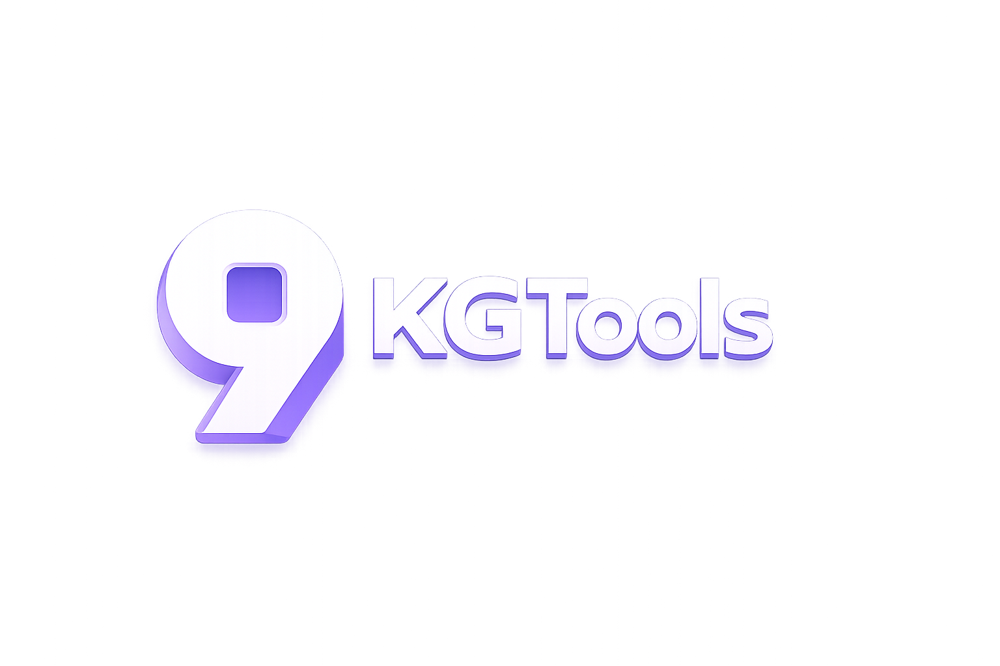
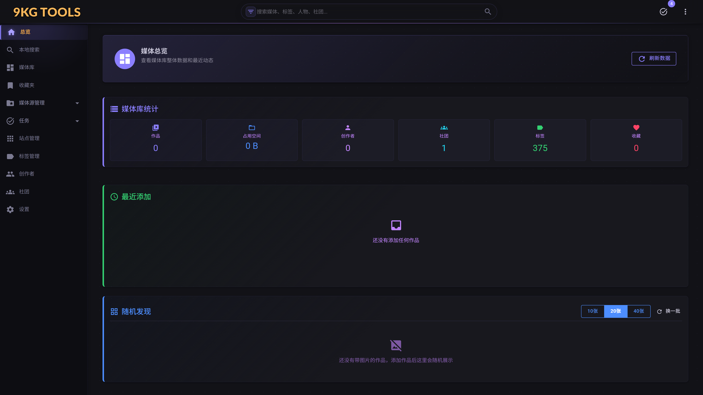
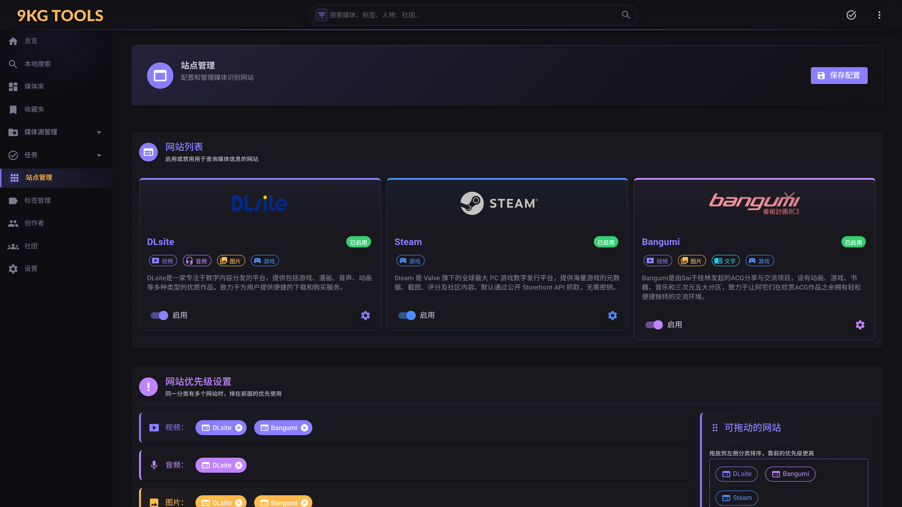
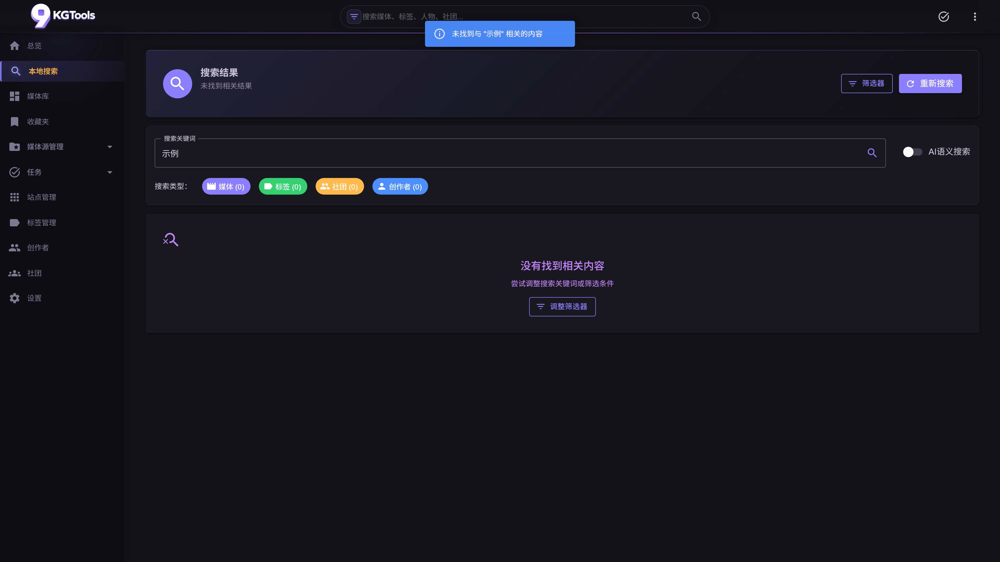
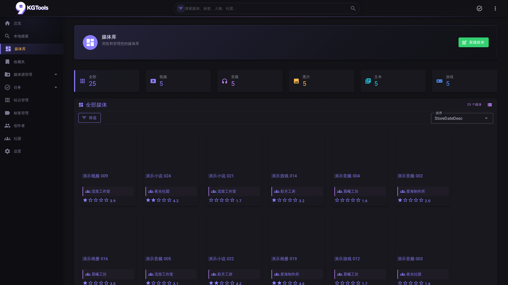
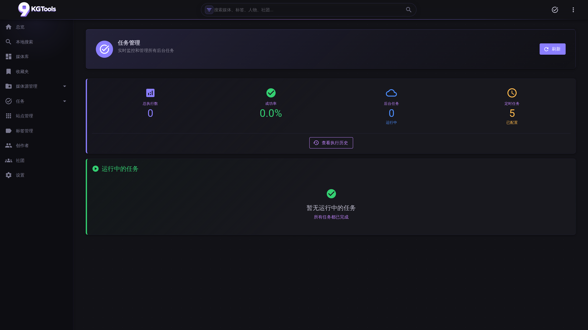
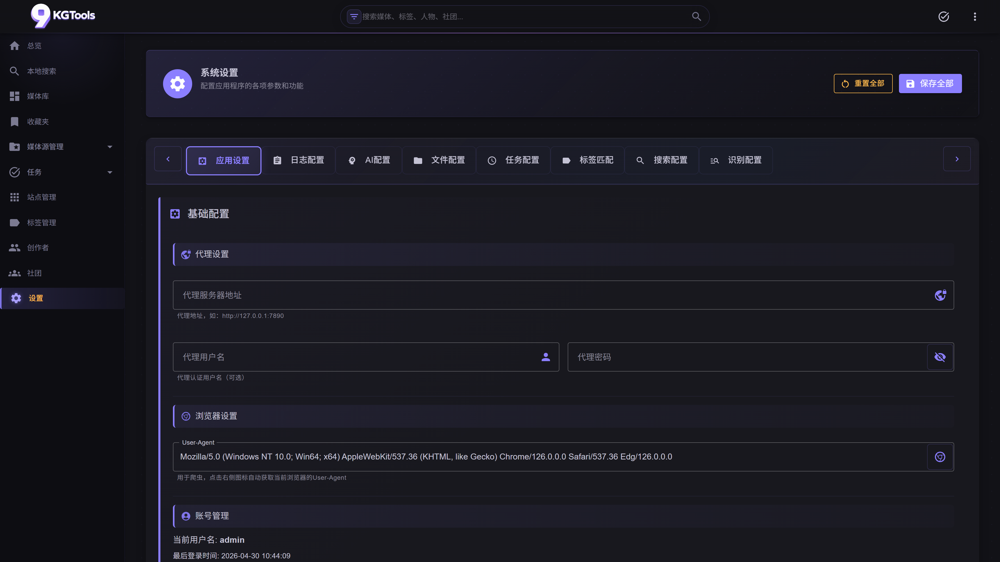

<div align="center">



# NineKgTools

**为个人媒体库打造的智能识别与管理系统**

基于 .NET 9 + Blazor，一站式整理海量音频 / 视频 / 游戏 / 图片 / 文本资源
—— 让零散的文件夹变回可以检索、可以欣赏的收藏。

<br />

[](https://dotnet.microsoft.com/)
[](LICENSE)
[](https://github.com/hphphp123321/NineKgTools/actions)
[](https://github.com/hphphp123321/NineKgTools/pkgs/container/ninekg-tools)
[](CONTRIBUTING.md)
[](CODE_OF_CONDUCT.md)

<br />

<sub>
  <a href="#-快速开始">🚀 快速开始</a> ·
  <a href="#-核心特性">✨ 核心特性</a> ·
  <a href="#-项目速览">📸 项目速览</a> ·
  <a href="#-典型使用场景">💡 使用场景</a> ·
  <a href="#-识别源矩阵">🎯 识别源</a> ·
  <a href="#-文档导航">📚 文档</a> ·
  <a href="#-路线图">🗺 路线图</a>
</sub>

</div>

---

## 😭 写在最前面
本项目**绝大多数**代码以及文档均为AI生成，本人能力精力极为有限，摸鱼了几年才摸出来这个项目，最后还得靠AI来辅助实现（AI太好用了你们知道吗

如果在使用过程中遇到bug（极有可能）和有什么想法欢迎在Issue以及Discussions里讨论


## 🤔 这是什么

**NineKgTools** 解决一个很具体的痛苦：**你硬盘里散落着上百（千？）个（R18）音频、视频、游戏、图片、文本资源，但你已经想不起来它们是什么了。**

它自动读取这些文件与文件夹，结合识别源（DLsite / Bangumi / Steam）和 AI （可选）补全元数据，把你的媒体收藏重新变得**可检索、可标签化、可语义搜索**。过程中你能看到每一次识别是怎么发生的——关键词怎么切分、查了哪几个网站、各返回了什么、为什么最终选了这条结果。

没有云服务、没有订阅、没有数据上传给第三方，同时也不会提供任何资源下载！（请支持正版喵）。

```bash
docker run -d -p 23333:23333 \
  -e OPENAI_API_KEY=sk-... \
  -v $PWD/data:/app/Database \
  -v $PWD/media:/app/media \
  ghcr.io/hphphp123321/ninekg-tools:latest
# 打开 http://localhost:23333
```

---

## ✨ 核心特性

<table>
<tr>
<td width="50%" valign="top">

### 🧠 智能识别 + 诊断可视化

文件名 → 关键词 → 多网站并查 → 最佳候选。每次识别都会生成一份「识别诊断快照」，完整保留**切词 / 尝试的网站 / Top 5 候选 / 命中分数 / 跳过原因**，在任务详情 Tab 可视化展现。


</td>
<td width="50%" valign="top">

### 🔎 向量语义搜索

基于 Microsoft Semantic Kernel + OpenAI Embedding + SqliteVec。

> 搜 "黄昏 海边 独白" 会找出描述接近的作品，而不是文件名里带这些字的。

媒体向量化、标签向量化都支持，配置开关一键启用。

</td>
</tr>
<tr>
<td width="50%" valign="top">

### 📚 五大媒体类型统一管理

音频 / 视频 / 游戏 / 图片 / 文本 —— 一个 UI，按分类切换。

完整的**标签系统**（中文分词 jieba.NET + 标签映射 + 多级匹配策略）、**收藏夹**、**创作者 / 社团**、**评分**、**自动封面抓取**。

冷门资源识别源搜不到？"手动添加"流程保证零条目遗漏。

</td>

</tr>

</table>

---

## 📸 项目速览

> 截图由 [`scripts/screenshots/`](scripts/screenshots/) 下的 Playwright 脚本自动生成（4K UHD，3840×2160）。

<!-- SCREENSHOTS_START -->
<table>
<tr>
<td width="50%"><p align="center"><sub><b>🏠 首页</b> — 媒体库统计 + 最近添加 + 随机发现</sub></p></td>
<td width="50%"><p align="center"><sub><b>🌐 识别源</b> — DLsite / Steam / Bangumi 三大站点 + 优先级拖拽</sub></p></td>
</tr>
<tr>
<td width="50%"><p align="center"><sub><b>🔎 全局搜索</b> — 媒体 / 标签 / 社团 / 创作者 多类型聚合</sub></p></td>
<td width="50%"><p align="center"><sub><b>📚 媒体库</b> — 五大类型统一管理，按分类卡片切换</sub></p></td>
</tr>
<tr>
<td width="50%"><p align="center"><sub><b>⚙️ 任务系统</b> — Hangfire 调度 + 父子任务树 + 实时进度</sub></p></td>
<td width="50%"><p align="center"><sub><b>🛠 系统设置</b> — 7 个分类标签页可视化覆盖全部 yaml 配置</sub></p></td>
</tr>
</table>
<!-- SCREENSHOTS_END -->

---

## 💡 典型使用场景

<table>
<tr><th width="22%">角色</th><th>典型用法</th></tr>
<tr>
<td>📚 <b>媒体收藏者</b></td>
<td>有几千个音声 / 游戏 / 动画文件夹散落在电脑或者NAS上，想一次性整理成可检索的媒体库，不想用 Jellyfin 那种只面向流媒体的方案。</td>
</tr>
<tr>
<td>🎮 <b>同人 / 独立游戏玩家</b></td>
<td>Steam 库之外还有大量从 DLsite / Itch / 社团官网攒下的作品，需要 Steam 和 DLsite 同时作为识别源。</td>
</tr>
<tr>
<td>🔧 <b>自托管爱好者</b></td>
<td>所有数据本地存储、SQLite 单文件持久化、Docker 一行启动、不依赖任何云服务（OpenAI 可选、可配置代理）。</td>
</tr>
</table>

**明确的非目标**：NineKgTools 不是流媒体服务器、不提供转码 / 转封装 / 在线播放、不做 DRM 内容管理。它只负责"知道你拥有什么"。播放请配合本地播放器或系统关联。

---

## 🚀 快速开始

### 方式 A：Docker（推荐）

```bash
# 1. 准备工作目录
mkdir -p ninekg-tools && cd ninekg-tools
mkdir -p data logs config media

# 2. 下载 compose 配置与环境变量模板
curl -O https://raw.githubusercontent.com/hphphp123321/NineKgTools/main/docker-compose.yml
curl -O https://raw.githubusercontent.com/hphphp123321/NineKgTools/main/.env.example
cp .env.example .env

# 3. 编辑 .env 填入 OPENAI_API_KEY（必填）
#    Bangumi API Key 启动后在 Web UI /website 页面填

# 4. 启动
docker compose up -d
```

浏览器访问 **`http://localhost:23333`**，默认账号 **`admin / admin`**（可通过 `.env` 的 `NT_USER` / `NT_PASSWORD` 覆盖）。

**持久化目录**（建议定期备份 `./data`）：

| 主机路径 | 容器路径 | 说明 |
|---|---|---|
| `./data` | `/app/Database` | SQLite 主库 + 向量库 + Hangfire 库 |
| `./logs` | `/app/Logs` | Serilog 日志文件 |
| `./config` | `/app/Config` | `config.yaml` + `tags.yaml` |
| `./media` | `/app/media` | `watch_folders` 监视的媒体目录 |

> **关于 Selenium**：Docker 镜像不内置 Chromium（体积考量）。`config.yaml` 里 `dlsite.use_selenium_for_rating: false` 默认关闭，主流程用 HTML / REST API 直抓——Docker 部署完全够用。需要 Chromium 的话请自行打包编译。

> **关于数据库**：默认行为是**保留已有数据**。若想清库重建（如开发期），临时设 `NINEKG_RESET_DB=true` 再启动一次。

### 方式 B：Windows 便携版（无需 Docker、无需 .NET SDK）

最适合**只想双击启动、不愿装环境**的 Windows 用户。

1. 去 [Releases 最新版](https://github.com/hphphp123321/NineKgTools/releases/latest) 下载 `NineKgTools-win-x64.zip`
2. 解压到任意目录（如 `D:\NineKgTools\`）
3. 用记事本编辑 `Config\config.yaml`，把 `ai.open_ai.api_key` 填上
4. 双击 `NineKgTools.Web.exe` 启动
5. 浏览器访问 **`http://localhost:23333`**，账号 `admin / admin`

> 便携版自带 .NET 9 Runtime，**不依赖系统 .NET 安装**。所有数据保存在 exe 同目录的 `Database\` `Logs\` 文件夹里，删除整个目录即可干净卸载。

如果想从源码自己打包：

```powershell
# Windows
.\scripts\publish\build-windows.ps1 -Zip
```

```bash
# Linux / macOS（CI 通用，cross-publish 出 win-x64）
bash scripts/publish/build-windows.sh --zip
```

产物在 `publish/NineKgTools-win-x64.zip`。

### 方式 C：从源码 dotnet run（开发者）

```bash
git clone https://github.com/hphphp123321/NineKgTools.git
cd NineKgTools

# 配置
cp Config/config.example.yaml Config/config.yaml
# Windows PowerShell：
[Environment]::SetEnvironmentVariable("OPENAI_API_KEY", "sk-...", "User")

# 启动
dotnet run --project NineKgTools.Web
```

端口默认 `23333`，可在 `config.yaml` → `app.web_port` 修改。

---

## ⚙️ 配置与 API Key

项目使用**单一 YAML 配置文件** `Config/config.yaml`（从 [`Config/config.example.yaml`](Config/config.example.yaml) 复制而来）。敏感字段支持环境变量覆盖：

| 字段 | 覆盖环境变量 | 是否必填 |
|---|---|---|
| `ai.open_ai.api_key` | `OPENAI_API_KEY` | 必填（启用 AI 时） |
| `ai.open_ai.base_domain` | — | 可选（自定义 OpenAI 代理） |
| `website.bangumi.api_key` | — | 可选（启用 Bangumi 识别时需要） |

完整字段说明见 **[配置参考文档](docs/reference/config.md)**（33 KB，每个字段都有详细注释）。

<details>
<summary>📍 <b>API Key 从哪里申请？</b></summary>

- **OpenAI Key**：[platform.openai.com](https://platform.openai.com/) 或任何兼容 OpenAI 协议的代理（`base_domain` 自定义）
- **Bangumi Key**：[next.bgm.tv/demo/access-token](https://next.bgm.tv/demo/access-token)（免费，只要 bgm.tv 账号）
- **DLsite / Steam**：不需要 key，零配置

</details>

---

## 🎯 识别源矩阵

| 识别源 | 适用分类 | 认证方式 | ID 格式 | 实现位置 |
|---|---|---|---|---|
| **DLsite** | 音频 / 视频 / 游戏 / 图片 | 无 | `RJ01081508` | HTML 爬取 |
| **Bangumi** | 视频 / 游戏 / 文本 / 图片 | Bearer Token | `22905` | REST API |
| **Steam** | 游戏 | 无 | `730` (AppID) | 公开 Storefront API |

优先级在 `config.yaml` → `website.priority.*` 按媒体类型独立配置，或在 Web UI `/website` 页面拖拽调整。

**想接入新的识别源？** 实现 `IWebsite` 接口 + 注册 DI 即可，参考 [`NineKgTools.Core/Core/Services/Websites/Steam/`](NineKgTools.Core/Core/Services/Websites/Steam/) 作为最简样例（不到 400 行）。

---

## 🏗 技术栈

<table>
<tr><th>领域</th><th>选型</th><th>为什么</th></tr>
<tr><td>运行时</td><td>.NET 9</td><td>性能、单文件部署、跨平台容器友好</td></tr>
<tr><td>Web UI</td><td>Blazor Server + MudBlazor 8</td><td>C# 单语言全栈、Material Design、SignalR 实时推送</td></tr>
<tr><td>桌面端</td><td>MAUI Blazor Hybrid</td><td>复用 Web 组件，v1.1 发布</td></tr>
<tr><td>后台任务</td><td>Hangfire 1.8 + SQLite 存储</td><td>Dashboard 开箱即用、持久化重启不丢任务</td></tr>
<tr><td>存储</td><td>SQLite + EF Core 9</td><td>零运维、单文件便于备份、性能足够</td></tr>
<tr><td>向量库</td><td>SqliteVec (Microsoft.SemanticKernel)</td><td>不引入 Qdrant/Milvus 的运维负担</td></tr>
<tr><td>AI</td><td>OpenAI (via Semantic Kernel)</td><td>协议标准，任何兼容代理均可替换</td></tr>
<tr><td>抓取</td><td>HtmlAgilityPack + Selenium (可选)</td><td>先 HTML 解析，动态页面才启 Selenium</td></tr>
<tr><td>日志</td><td>Serilog 4</td><td>结构化日志、Sink 可插拔（Console/File/Syslog）</td></tr>
<tr><td>中文分词</td><td>jieba.NET</td><td>识别关键词提取、标签匹配的基石</td></tr>
</table>

---

## 📂 项目结构

```
NineKgTools/
├── NineKgTools.Core/         # 共享业务逻辑（210+ .cs，~60% 代码量在此）
│   └── Core/Services/        #   AI / Auth / Cache / Files / Media / Tasks / Websites ...
├── NineKgTools.Web/          # Blazor Server Web 端（启动项目）
│   ├── Pages/                #   20+ 路由页面
│   ├── Components/           #   可复用组件（Medias / Tasks / Common / ...）
│   └── wwwroot/css/          #   模块化 CSS（variables / utilities / components / pages）
├── NineKgTools.Desktop/      # MAUI Blazor Hybrid 桌面端（v1.1 发布）
├── NineKgTools.Tests/        # xUnit 测试
├── Config/                   # YAML 配置（config.example.yaml 作为模板）
├── docs/                     # 项目文档（架构、配置、前端设计指南…）
└── scripts/screenshots/      # README 截图自动化（Playwright）
```

深度文档见 [`docs/README.md`](docs/README.md) 和 [CLAUDE.md](CLAUDE.md)（后者是 AI 助手使用的工程约定摘要）。

---

## 🗺 路线图

### ✅ v0.1.0（首次公开发布）
- [x] 三大识别源（DLsite / Bangumi / Steam）
- [x] 五类媒体的完整 CRUD + 搜索 + 标签
- [x] Hangfire 任务系统 + 识别诊断
- [x] 向量搜索（媒体 + 标签）
- [x] Pending 识别（已识别未入库的缓冲区）
- [x] 监视文件夹自动入库
- [x] Docker 容器化部署
- [x] 自动化截图 CI 

### 🚧 后续小版本规划
- [ ] **桌面端发布**（MAUI Windows MSIX + portable zip）
- [ ] **Chromium 变种镜像**（`ghcr.io/hphphp123321/ninekg-tools:full`），Selenium 抓取全可用
- [ ] 新识别源
- [ ] 远程NAS访问支持

### 💡 更远的想法
- 多用户权限模型
- 插件式识别源（无需改 Core）
- 生成式 AI 用于封面 / 简介补全

想法参与：欢迎在 [Discussions](https://github.com/hphphp123321/NineKgTools/discussions) 里提。

---

## 📚 文档导航

| 文档 | 适合谁 | 内容 |
|---|---|---|
| 📖 **[docs/user-guide/](docs/user-guide/)** ⭐ | **终端用户** | **按页面 + 工作流的详细使用指南（14 篇）** |
| [docs/README.md](docs/README.md) | 所有人 | 项目概览与全部文档入口 |
| [docs/development/README.md](docs/development/README.md) <sup>v1.0</sup> | 贡献者 | 本地开发环境、迁移、调试技巧 |
| [docs/operations/deployment.md](docs/operations/deployment.md) <sup>v1.0</sup> | 运维 / 自托管 | Docker / 反代 / 备份 / 升级 |
| [docs/reference/config.md](docs/reference/config.md) | 所有人 | `config.yaml` 每一项说明 |
| [docs/reference/tags-yaml.md](docs/reference/tags-yaml.md) | 所有人 | `tags.yaml` 标签字典格式 |
| [docs/development/frontend-design.md](docs/development/frontend-design.md) | 前端贡献者 | 组件约定、反模式 checklist |
| [docs/architecture/ai-system.md](docs/architecture/ai-system.md) | 深度开发 | AI 与向量库架构 |
| [docs/architecture/media-identification-flow.md](docs/architecture/media-identification-flow.md) | 深度开发 | 识别流程（含诊断系统） |
| [docs/architecture/task-management-system.md](docs/architecture/task-management-system.md) | 深度开发 | Hangfire 调度、父子任务 |

---

## 🤝 贡献

欢迎任何形式的贡献——issue、PR、讨论、文档改进都同样重要。

开始前请阅读：
- 📖 [CONTRIBUTING.md](CONTRIBUTING.md) —— 分支、commit、PR 流程
- 🤗 [CODE_OF_CONDUCT.md](CODE_OF_CONDUCT.md) —— 社区行为准则
- 🔒 [SECURITY.md](SECURITY.md) —— 发现安全漏洞请私下报告

**小改动**（typo、明显 bug）直接开 PR；**大改动**（新功能、架构调整）先开 Issue 讨论。

---

## 💖 致谢

这个项目站在一大堆优秀开源作品的肩膀上：

[MudBlazor](https://mudblazor.com/) · [Hangfire](https://www.hangfire.io/) · [Serilog](https://serilog.net/) · [Microsoft Semantic Kernel](https://github.com/microsoft/semantic-kernel) · [Entity Framework Core](https://learn.microsoft.com/ef/core/) · [HtmlAgilityPack](https://html-agility-pack.net/) · [jieba.NET](https://github.com/anderscui/jieba.NET) · [SixLabors.ImageSharp](https://sixlabors.com/products/imagesharp/) · [Playwright](https://playwright.dev/)

以及三大元数据来源：**DLsite** · **Bangumi 番组计划** · **Steam**。

---

## 📜 License

本项目采用 [**MIT License**](LICENSE) 发布。

你可以自由地使用、修改、再分发——商业或个人用途都可以。唯一要求：保留版权声明与许可证文本。

---

<div align="center">

**如果这个项目对你有帮助，请点一个 ⭐ Star**——这是我继续投入最好的动力。

<sub>
  Built with ❤️ and a lot of <code>dotnet watch</code>.
</sub>

</div>
