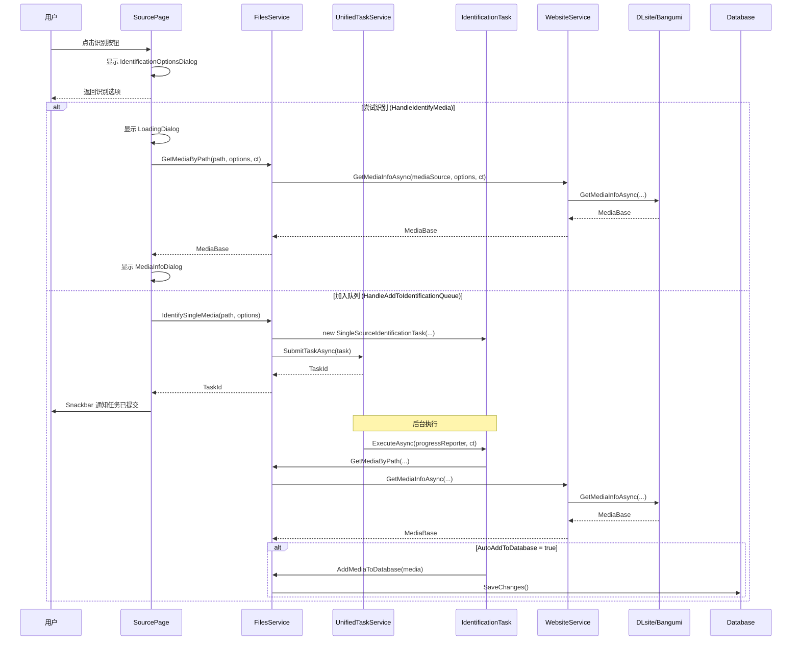
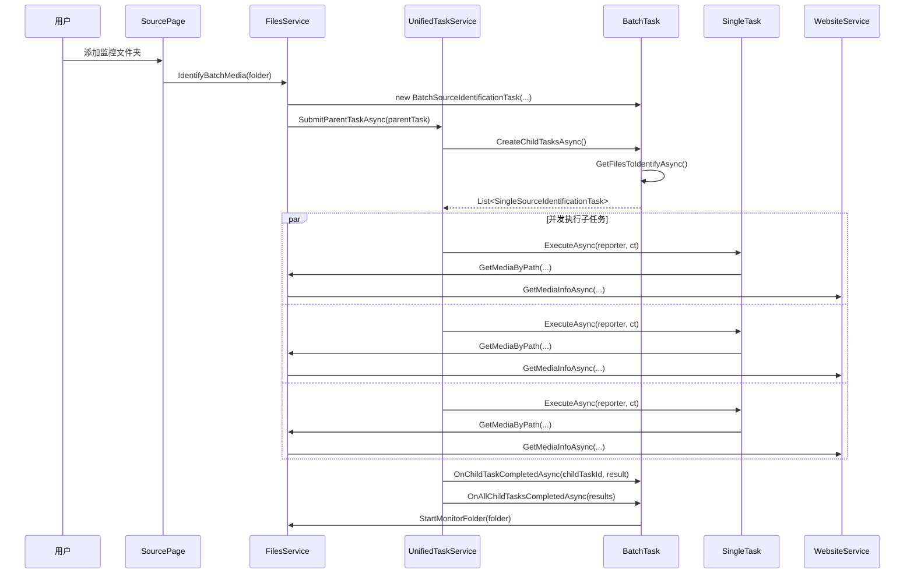
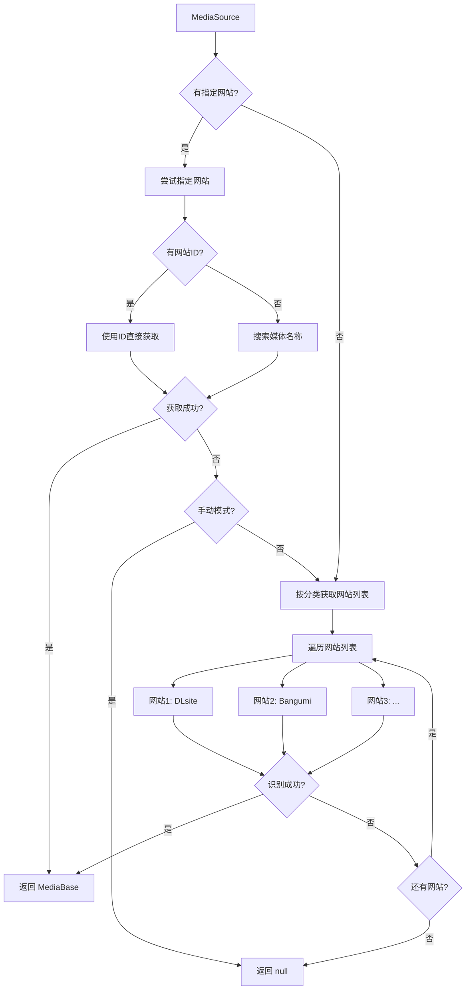

# 媒体识别流程文档

## 目录
1. [架构概述](#架构概述)
2. [前端入口](#前端入口)
3. [服务层](#服务层)
4. [任务层](#任务层)
5. [网站层](#网站层)
6. [识别策略](#识别策略)
7. [流程图](#流程图)

## 架构概述

NineKgTools 的媒体识别系统采用**分层架构**设计，从前端到后端共四层：

```
┌─────────────────────────────────────────────────────────────────┐
│                         前端层 (Web/UI)                          │
│  SourcePage.razor.cs                                            │
│  ├─ HandleIdentifyMedia()      → 同步识别，等待结果             │
│  ├─ HandleAddToIdentificationQueue() → 异步识别，提交后返回     │
│  └─ _addSourceFolder()         → 批量识别，添加监控             │
└────────────────────────────────────┬────────────────────────────┘
                                     │
                                     ▼
┌─────────────────────────────────────────────────────────────────┐
│                       服务层 (FilesService)                      │
│  对外接口（前端调用）：                                          │
│  ├─ IdentifyBatchMedia()   → 批量识别，返回 TaskId              │
│  └─ IdentifySingleMedia()  → 单个识别，返回 TaskId              │
│  对内接口（任务层调用）：                                        │
│  └─ GetMediaByPath()       → 核心识别逻辑                       │
└────────────────────────────────────┬────────────────────────────┘
                                     │
                                     ▼
┌─────────────────────────────────────────────────────────────────┐
│                         任务层 (Tasks)                           │
│  UnifiedTaskService                                             │
│  ├─ SubmitTaskAsync()        → 提交普通任务到 Hangfire          │
│  ├─ SubmitParentTaskAsync()  → 提交父任务（创建子任务）          │
│  └─ CancelTask() / CancelTaskTree() → 取消任务                  │
│                                                                  │
│  任务类型：                                                      │
│  ├─ SingleSourceIdentificationTask → 单文件识别                 │
│  └─ BatchSourceIdentificationTask  → 批量识别（父任务模式）      │
└────────────────────────────────────┬────────────────────────────┘
                                     │
                                     ▼
┌─────────────────────────────────────────────────────────────────┐
│                       网站层 (WebsiteService)                    │
│  WebsiteService                                                 │
│  ├─ GetMediaInfoAsync()              → 按优先级遍历网站识别     │
│  └─ IdentifyBySpecificWebsiteAsync() → 特定网站识别             │
│                                                                  │
│  具体网站：                                                      │
│  ├─ DLsiteService   → DLsite 音声/游戏识别                      │
│  ├─ BangumiService  → Bangumi 动画/游戏识别                     │
│  └─ ...                                                         │
└─────────────────────────────────────────────────────────────────┘
```

## 前端入口

**文件**: `NineKgTools.Web/Pages/Sources/SourcePage.razor.cs`

前端提供三种识别入口，区别如下：

### 1. 尝试识别 (`HandleIdentifyMedia`)

**触发方式**: 点击文件/文件夹右侧的 🔍 图标

**特点**:
- **同步等待**：显示 LoadingDialog，等待识别完成
- **直接调用**：使用 `FilesService.GetMediaByPath()`
- **结果展示**：成功后弹出 MediaInfoDialog 显示详情
- **支持取消**：用户可点击取消按钮中断识别

```csharp
private async Task HandleIdentifyMedia(string? path)
{
    // 1. 打开 IdentificationOptionsDialog 配置识别选项
    var dialog = await DialogService.ShowAsync<IdentificationOptionsDialog>(...);
    var identificationOptions = dialog.Result.Data as IdentificationOptions;

    // 2. 显示 LoadingDialog（支持取消）
    using var cancellationTokenSource = new CancellationTokenSource();
    var loadingDialog = await DialogService.ShowAsync<LoadingDialog>(...);

    // 3. 直接调用 GetMediaByPath（同步等待结果）
    var media = await FilesService.GetMediaByPath(path, identificationOptions, null, cts.Token);

    // 4. 显示结果
    if (media != null) await ShowMediaInfoDialog(media);
}
```

### 2. 加入识别队列 (`HandleAddToIdentificationQueue`)

**触发方式**: 点击文件/文件夹右侧的 ➕ 图标

**特点**:
- **异步提交**：提交任务后立即返回，不等待结果
- **队列处理**：使用 `FilesService.IdentifySingleMedia()` 提交到 Hangfire
- **结果通知**：通过 Snackbar 提示任务已提交

```csharp
private async Task HandleAddToIdentificationQueue(string? path)
{
    // 1. 打开 IdentificationOptionsDialog 配置识别选项
    var dialog = await DialogService.ShowAsync<IdentificationOptionsDialog>(...);
    var identificationOptions = dialog.Result.Data as IdentificationOptions;

    // 2. 提交任务到队列（立即返回 TaskId）
    var taskId = await FilesService.IdentifySingleMedia(path, identificationOptions);

    // 3. 显示提交成功通知
    Snackbar.Add($"已将 {fileName} 加入识别队列，任务ID: {taskId}", Severity.Success);
}
```

### 3. 添加监控文件夹 (`_addSourceFolder`)

**触发方式**: 点击"添加到监控列表"按钮

**特点**:
- **批量识别**：使用 `FilesService.IdentifyBatchMedia()`
- **自动监控**：识别完成后自动监控文件夹变化
- **并发处理**：每个文件作为独立子任务并行执行

```csharp
private async Task _addSourceFolder(string folder)
{
    _sourceConfig.WatchFolders.Add(folder);

    // 批量识别（返回父任务 TaskId）
    var taskId = await FilesService.IdentifyBatchMedia(folder);

    Snackbar.Add($"目录 {folder} 已添加至监视列表，批量识别任务已提交", Severity.Success);
}
```

## 服务层

**文件**: `NineKgTools.Core/Core/Services/Files/FilesService.cs`

FilesService 负责协调文件识别流程，提供两类接口：

### 对外接口（前端调用）

#### `IdentifyBatchMedia` - 批量识别

```csharp
/// <summary>
/// 【对外接口】批量识别文件夹中的媒体文件
/// </summary>
/// <param name="directoryPath">文件夹路径</param>
/// <param name="options">识别选项，为空即默认</param>
/// <param name="maxDepth">识别深度，0即directoryPath下的一层所有子文件夹</param>
/// <returns>任务ID，可用于查询进度或取消任务</returns>
public async Task<string> IdentifyBatchMedia(string directoryPath,
    IdentificationOptions? options = null, int maxDepth = 0)
{
    // 创建批量识别任务（父任务）
    var task = new BatchSourceIdentificationTask(
        _serviceScopeFactory,
        directoryPath,
        options ?? _config.Identification.ToIdentificationOptions(),
        maxDepth: 0,
        extensions: null,
        TaskPriority.Normal
    );

    // 提交父任务到队列
    var taskId = await _taskService.SubmitParentTaskAsync(task);
    return taskId;
}
```

#### `IdentifySingleMedia` - 单个识别

```csharp
/// <summary>
/// 【对外接口】识别单个媒体文件或文件夹
/// </summary>
/// <param name="path">文件或文件夹路径</param>
/// <param name="options">识别选项</param>
/// <returns>任务ID，可用于查询进度或取消任务</returns>
public async Task<string> IdentifySingleMedia(string path, IdentificationOptions? options = null)
{
    // 验证文件有效性
    if (!IsValidMediaSource(path))
    {
        throw new ArgumentException($"路径 '{path}' 不是有效的媒体源", nameof(path));
    }

    // 创建单个识别任务
    var task = new SingleSourceIdentificationTask(
        _serviceScopeFactory,
        path,
        options ?? _config.Identification.ToIdentificationOptions(),
        TaskPriority.High  // 用户手动触发的任务优先级更高
    );

    // 提交到任务队列
    var taskId = await _taskService.SubmitTaskAsync(task);
    return taskId;
}
```

### 对内接口（任务层调用）

#### `GetMediaByPath` - 核心识别逻辑

```csharp
/// <summary>
/// 【对内接口 - 仅供 Task 层使用】
/// 通过路径识别媒体信息，执行实际的网站查询和识别操作
/// </summary>
[EditorBrowsable(EditorBrowsableState.Advanced)]
public async Task<MediaBase?> GetMediaByPath(string path, IdentificationOptions? options,
    IProgressReporter? progressReporter = null, CancellationToken cancellationToken = default)
{
    // 1. 检查取消状态
    cancellationToken.ThrowIfCancellationRequested();

    // 2. 手动模式特殊处理
    if (options?.Strategy == IdentificationStrategy.Manual)
    {
        return await HandleManualIdentificationWithProgress(path, options, progressReporter, ct);
    }

    // 3. 验证文件有效性
    if (!IsValidMediaSource(path)) return null;

    // 4. 创建 MediaSource
    var mediaSource = MediaSourceFactory.Create(path);

    // 5. 检查数据库缓存
    var mediaDbSource = await _sourceService.FindMediaSourceAsync(mediaSource);
    if (mediaDbSource?.InDatabase == true && mediaDbSource.MediaBase != null)
    {
        if (!options?.SkipCache && options?.Strategy != IdentificationStrategy.ForceRefresh)
        {
            return await _mediaService.GetMediaAsync(mediaDbSource.MediaBase.Id);
        }
    }

    // 6. 调用 WebsiteService 识别
    var media = await _websiteService.GetMediaInfoAsync(mediaSource, options, cancellationToken);

    return media;
}
```

### 文件验证逻辑

```csharp
/// <summary>
/// 验证文件是否为有效的媒体文件（根据配置过滤）
/// </summary>
public bool IsValidMediaSource(string pathOrFileName)
{
    // 1. 检查忽略列表（精确匹配）
    foreach (var ignoredFile in _config.Files.IgnoredFiles)
    {
        if (fileName.Equals(ignoredFile, StringComparison.OrdinalIgnoreCase))
            return false;
    }

    // 2. 检查忽略模式（通配符匹配）
    foreach (var pattern in _config.Files.IgnoredPatterns)
    {
        if (MatchesPattern(fileName, pattern))
            return false;
    }

    // 3. 检查隐藏/系统文件
    // 4. 检查文件大小
    // 5. 检查扩展名白名单

    return true;
}
```

## 任务层

### UnifiedTaskService

**文件**: `NineKgTools.Core/Core/Services/Tasks/UnifiedTaskService.cs`

统一任务服务，管理所有任务的提交、执行和取消。

```csharp
public class UnifiedTaskService
{
    /// <summary>
    /// 提交普通任务到队列
    /// </summary>
    public async Task<string> SubmitTaskAsync(ITask task)
    {
        // 1. 验证任务参数
        if (!task.ValidateParameters())
            throw new ArgumentException("任务参数无效");

        // 2. 提交到 Hangfire
        var jobId = BackgroundJob.Enqueue(() => ExecuteTaskAsync(task));

        // 3. 记录任务元数据
        _metadataStore.RegisterTask(task.TaskId, jobId);

        return task.TaskId;
    }

    /// <summary>
    /// 提交父任务（会自动创建子任务）
    /// </summary>
    public async Task<string> SubmitParentTaskAsync(IParentTask parentTask)
    {
        // 1. 创建子任务列表
        var childTasks = await parentTask.CreateChildTasksAsync();

        // 2. 使用 Hangfire BatchJob 管理
        BatchJob.StartNew(batch =>
        {
            foreach (var childTask in childTasks)
            {
                batch.Enqueue(() => ExecuteTaskAsync(childTask));
            }
        });

        return parentTask.TaskId;
    }

    /// <summary>
    /// 取消正在执行或等待中的任务
    /// </summary>
    public bool CancelTask(string taskId)
    {
        var jobId = _metadataStore.GetJobIdByTaskId(taskId);
        if (string.IsNullOrEmpty(jobId)) return false;

        BackgroundJob.Delete(jobId);
        return true;
    }

    /// <summary>
    /// 批量取消任务（包括父任务的所有子任务）
    /// </summary>
    public int CancelTaskTree(string parentTaskId)
    {
        var taskTree = _progressService.GetTaskTree(parentTaskId);
        var canceledCount = 0;

        void CancelRecursive(TaskProgress task)
        {
            if (CancelTask(task.TaskId)) canceledCount++;
            foreach (var child in task.ChildTasks) CancelRecursive(child);
        }

        CancelRecursive(taskTree);
        return canceledCount;
    }
}
```

### SingleSourceIdentificationTask

**文件**: `NineKgTools.Core/Core/Services/Tasks/IdentificationTasks/SingleSourceIdentificationTask.cs`

单文件识别任务，处理单个媒体源。

```csharp
public class SingleSourceIdentificationTask : IIdentificationTask
{
    public string TaskType => "SingleSourceIdentification";
    public string? Description => $"识别文件: {Path.GetFileName(_filePath)}";
    public bool IsBatch => false;

    public async Task<TaskResult> ExecuteAsync(IProgressReporter progressReporter,
        CancellationToken cancellationToken = default)
    {
        await progressReporter.ReportStartAsync(1, $"开始识别文件: {Path.GetFileName(_filePath)}");

        var media = await IdentifyAsync(progressReporter, cancellationToken);

        if (media != null)
        {
            await progressReporter.ReportCompleteAsync($"识别成功: {media.Title}", 1, 0);
            return TaskResult.CreateSuccess(TaskId, TaskName, $"成功识别: {media.Title}", 1);
        }
        else
        {
            await progressReporter.ReportErrorAsync("识别失败: 未能获取媒体信息");
            return TaskResult.CreateFailure(TaskId, TaskName, "识别失败");
        }
    }

    public async Task<MediaBase?> IdentifyAsync(IProgressReporter progressReporter,
        CancellationToken cancellationToken = default)
    {
        // 创建新的作用域并解析 FilesService
        using var scope = _serviceScopeFactory.CreateScope();
        var filesService = scope.ServiceProvider.GetRequiredService<FilesService>();

        // 调用核心识别逻辑
        var media = await filesService.GetMediaByPath(_filePath, _options, progressReporter, cancellationToken);

        // 如果识别成功且选项要求自动添加到数据库
        if (media != null && _options?.AutoAddToDatabase == true)
        {
            await progressReporter.ReportPhaseAsync("正在保存到数据库", 90);
            await filesService.AddMediaToDatabase(media, cancellationToken);
        }

        return media;
    }
}
```

### BatchSourceIdentificationTask

**文件**: `NineKgTools.Core/Core/Services/Tasks/IdentificationTasks/BatchSourceIdentificationTask.cs`

批量识别任务，使用父任务模式管理多个子任务。

```csharp
public class BatchSourceIdentificationTask : IParentTask, IIdentificationTask
{
    public string TaskType => "BatchSourceIdentification";
    public string? Description => $"批量识别文件夹: {Path.GetFileName(_folderPath)}";
    public bool IsBatch => true;

    /// <summary>
    /// 创建子任务列表 - 为每个文件创建独立的 SingleSourceIdentificationTask
    /// </summary>
    public async Task<List<ITask>> CreateChildTasksAsync()
    {
        var files = await GetFilesToIdentifyAsync();
        var childTasks = new List<ITask>();

        foreach (var filePath in files)
        {
            var childTask = new SingleSourceIdentificationTask(
                _serviceScopeFactory,
                filePath,
                _options,
                Priority
            );
            childTask.ParentTaskId = TaskId;
            childTasks.Add(childTask);
        }

        return childTasks;
    }

    /// <summary>
    /// 所有子任务完成后的回调 - 汇总结果并启动文件夹监控
    /// </summary>
    public async Task OnAllChildTasksCompletedAsync(List<TaskResult> childResults)
    {
        var successCount = childResults.Count(r => r.Success);
        var failedCount = childResults.Count - successCount;

        Log.Information("文件夹批量识别任务完成: {FolderPath}, 成功: {Success}/{Total}",
            _folderPath, successCount, childResults.Count);

        // 如果任务成功，开始监控文件夹
        if (_batchResult.Success)
        {
            using var scope = _serviceScopeFactory.CreateScope();
            var filesService = scope.ServiceProvider.GetRequiredService<FilesService>();
            filesService.StartMonitorFolder(_folderPath);
        }
    }

    /// <summary>
    /// 获取待识别的文件列表
    /// </summary>
    public async Task<List<string>> GetFilesToIdentifyAsync()
    {
        // 递归扫描目录，支持深度控制
        ScanDirectoryWithDepth(_folderPath, 0, _maxDepth, filesService, results);
        return results;
    }
}
```

## 网站层

### WebsiteService

**文件**: `NineKgTools.Core/Core/Services/Websites/WebsiteService.cs`

网站协调服务，管理所有网站的优先级和识别调度。

```csharp
public class WebsiteService
{
    // 网站名称 -> 网站实例映射
    public Dictionary<string, IWebsite> WebsiteNameMap { get; }

    // 媒体分类 -> 网站优先级列表
    public Dictionary<TopCategory, List<IWebsite>> Websites { get; }

    /// <summary>
    /// 获取媒体信息（按优先级遍历网站）
    /// </summary>
    public async Task<MediaBase?> GetMediaInfoAsync(MediaSource mediaSource,
        IdentificationOptions? options, CancellationToken cancellationToken = default)
    {
        cancellationToken.ThrowIfCancellationRequested();

        // 1. 如果指定了优先网站，仅使用该网站
        if (options?.PreferredWebsite != null)
        {
            if (WebsiteNameMap.TryGetValue(options.PreferredWebsite, out var preferredWebsite))
            {
                var websiteId = options.GetWebsiteId(options.PreferredWebsite);
                if (!string.IsNullOrEmpty(websiteId))
                {
                    // 检查缓存
                    var cached = await _cacheService.GetAsync(options.PreferredWebsite, websiteId, options);
                    if (cached != null) return cached;

                    // 使用网站特定ID获取
                    var media = await preferredWebsite.GetMediaInfoAsync(websiteId, mediaSource, ct);
                    if (media != null) return media;
                }
            }

            // 手动模式下优先网站失败，直接返回null
            if (options.Strategy == IdentificationStrategy.Manual)
                return null;
        }

        // 2. 按优先级获取网站列表
        var websiteList = options?.WebsitePriorityOverride != null
            ? GetWebsitesByPriority(options.WebsitePriorityOverride)
            : GetWebsitesByCategory(mediaSource.PossibleTopCategory);

        // 3. 遍历网站尝试识别
        foreach (var website in websiteList.Where(w => w.Enable))
        {
            cancellationToken.ThrowIfCancellationRequested();

            var specificId = options?.GetWebsiteId(website.Name);
            MediaBase? media = null;

            // 尝试使用网站特定ID
            if (!string.IsNullOrEmpty(specificId))
            {
                media = await website.GetMediaInfoAsync(specificId, mediaSource, ct);
            }

            // 尝试常规识别
            if (media == null)
            {
                media = await website.GetMediaInfoAsync(mediaSource, ct);
            }

            if (media != null) return media;
        }

        return null;
    }

    /// <summary>
    /// 通过特定网站和ID识别媒体
    /// </summary>
    public async Task<MediaBase?> IdentifyBySpecificWebsiteAsync(
        string websiteName, string websiteId, MediaSource? mediaSource = null,
        IdentificationOptions? options = null, CancellationToken cancellationToken = default)
    {
        cancellationToken.ThrowIfCancellationRequested();

        if (!WebsiteNameMap.TryGetValue(websiteName, out var website))
            return null;

        if (!website.Enable) return null;

        var media = await website.GetMediaInfoAsync(websiteId, mediaSource, cancellationToken);

        // 如果有自定义名称，覆盖媒体标题
        if (media != null && !string.IsNullOrEmpty(options?.CustomIdentificationName))
        {
            media.Title = options.CustomIdentificationName;
        }

        return media;
    }
}
```

### IWebsite 接口

**文件**: `NineKgTools.Core/Core/Services/Websites/IWebsite.cs`

所有网站服务的统一接口。

```csharp
public interface IWebsite
{
    string Name { get; }
    List<TopCategory> TopCategories { get; }
    bool Enable { get; }

    // 自动识别（通过文件名搜索）
    Task<MediaBase?> GetMediaInfoAsync(MediaSource mediaSource,
        CancellationToken cancellationToken = default);

    // 手动识别（通过网站特定ID）
    Task<MediaBase?> GetMediaInfoAsync(string id, MediaSource? mediaSource,
        CancellationToken cancellationToken = default);

    // 搜索媒体（返回优先级队列）
    Task<PriorityQueue<MediaSearchResult, double>> SearchMediaAsync(MediaSource mediaSource,
        CancellationToken cancellationToken = default);
}
```

### DLsiteService 示例

**文件**: `NineKgTools.Core/Core/Services/Websites/DLsite/DLsiteService.cs`

```csharp
public partial class DLsiteService : IWebsite
{
    public string Name => "DLsite";
    public List<TopCategory> TopCategories => [TopCategory.Audio, TopCategory.Video,
                                                TopCategory.Game, TopCategory.Picture];

    public async Task<MediaBase?> GetMediaInfoAsync(MediaSource mediaSource,
        CancellationToken cancellationToken = default)
    {
        var htmlDocument = await GetHtmlDocumentAsync(mediaSource, cancellationToken);
        return htmlDocument == null ? null
            : await this.ScrapeMediaFromHtmlAsync(mediaSource, htmlDocument, cancellationToken);
    }

    public async Task<MediaBase?> GetMediaInfoAsync(string id, MediaSource? mediaSource,
        CancellationToken cancellationToken = default)
    {
        cancellationToken.ThrowIfCancellationRequested();

        // 提取 DLsite 代码（RJ/VJ/BJ开头）
        var dlsiteCode = DLsiteUtils.TryGetDLsiteCodeByName(id);
        if (dlsiteCode == null) return null;

        // 构建URL并抓取
        var url = DLsiteUtils.GetUrlByDLsiteCode(dlsiteCode);
        var htmlDocument = await _http.Scrape(url, HttpMethod.Get, cancellationToken: ct);

        mediaSource ??= MediaSourceFactory.Create();
        return htmlDocument == null ? null
            : await this.ScrapeMediaFromHtmlAsync(mediaSource, htmlDocument, cancellationToken);
    }

    private async Task<string?> TryGetUrlByMediaSource(MediaSource mediaSource,
        CancellationToken cancellationToken = default)
    {
        var mediaName = Path.GetFileNameWithoutExtension(mediaSource.FullPath);

        // 1. 尝试从文件名提取 DLsite 代码
        var dlsiteCode = DLsiteUtils.TryGetDLsiteCodeByName(mediaName);
        if (dlsiteCode != null)
        {
            return DLsiteUtils.GetUrlByDLsiteCode(dlsiteCode);
        }

        // 2. 通过搜索名字获取URL
        var searchResult = await _dlsiteSearch.TrySearchUrlsByName(mediaName, ct);

        while (searchResult.Count > 0)
        {
            var media = searchResult.Dequeue();
            if (media.Category.TopCategory == mediaSource.PossibleTopCategory)
                return media.Url;
        }

        return null;
    }
}
```

## 识别策略

### IdentificationOptions

**文件**: `NineKgTools.Core/Core/Models/Identification/IdentificationOptions.cs`

```csharp
public class IdentificationOptions
{
    /// <summary>
    /// 识别策略
    /// </summary>
    public IdentificationStrategy Strategy { get; set; } = IdentificationStrategy.Auto;

    /// <summary>
    /// 优先使用的网站名称
    /// </summary>
    public string? PreferredWebsite { get; set; }

    /// <summary>
    /// 网站特定ID（如 RJ123456）
    /// </summary>
    public string? WebsiteSpecificId { get; set; }

    /// <summary>
    /// 多网站ID映射
    /// </summary>
    public Dictionary<string, string>? WebsiteIds { get; set; }

    /// <summary>
    /// 自定义识别名称（覆盖网站获取的标题）
    /// </summary>
    public string? CustomIdentificationName { get; set; }

    /// <summary>
    /// 是否跳过缓存
    /// </summary>
    public bool SkipCache { get; set; }

    /// <summary>
    /// 是否自动添加到数据库
    /// </summary>
    public bool AutoAddToDatabase { get; set; }

    /// <summary>
    /// 最大重试次数
    /// </summary>
    public int MaxRetries { get; set; }

    /// <summary>
    /// 网站优先级覆盖
    /// </summary>
    public List<string>? WebsitePriorityOverride { get; set; }
}
```

### IdentificationStrategy 枚举

```csharp
public enum IdentificationStrategy
{
    /// <summary>
    /// 自动识别（默认）
    /// </summary>
    Auto,

    /// <summary>
    /// 手动识别（必须指定网站和ID）
    /// </summary>
    Manual,

    /// <summary>
    /// 仅使用缓存
    /// </summary>
    CacheOnly,

    /// <summary>
    /// 强制刷新（跳过缓存，重新识别）
    /// </summary>
    ForceRefresh
}
```

## 流程图

### 完整识别流程



### 批量识别流程



### 网站识别流程



## 取消机制

### CancellationToken 传递链

```
前端 UI (CancellationTokenSource)
    ↓
FilesService.GetMediaByPath(ct)
    ↓
WebsiteService.GetMediaInfoAsync(ct)
    ↓
IWebsite.GetMediaInfoAsync(ct)
    ↓
HttpService.Scrape(ct)
```

### 取消检查点

1. **FilesService.GetMediaByPath** - 方法开始时
2. **WebsiteService.GetMediaInfoAsync** - 方法开始时、每个网站遍历前
3. **WebsiteService.IdentifyBySpecificWebsiteAsync** - 方法开始时
4. **各网站服务** - HTTP请求前

### 取消任务

```csharp
// 取消单个任务
bool success = taskService.CancelTask(taskId);

// 取消任务树（父任务及所有子任务）
int canceledCount = taskService.CancelTaskTree(parentTaskId);
```

## 总结

| 入口 | 方法 | 特点 | 返回值 |
|------|------|------|--------|
| 尝试识别 | `HandleIdentifyMedia` | 同步等待，显示结果 | MediaBase |
| 加入队列 | `HandleAddToIdentificationQueue` | 异步提交，立即返回 | TaskId |
| 批量识别 | `_addSourceFolder` | 创建父任务，并发执行 | TaskId |

| 接口类型 | 方法 | 调用者 | 说明 |
|----------|------|--------|------|
| 对外 | `IdentifyBatchMedia` | 前端 | 批量识别，返回TaskId |
| 对外 | `IdentifySingleMedia` | 前端 | 单个识别，返回TaskId |
| 对内 | `GetMediaByPath` | Task层 | 核心识别逻辑 |
