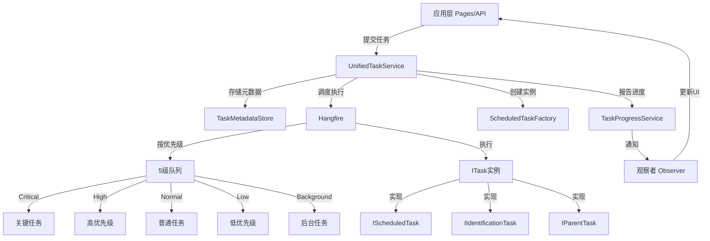
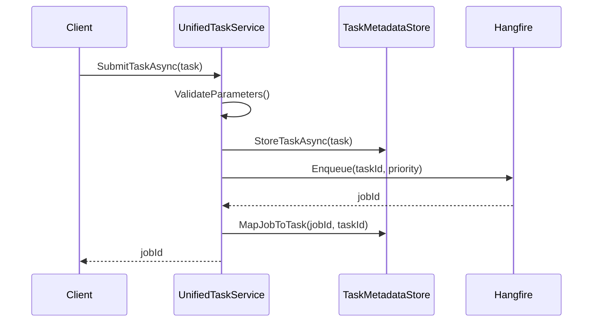
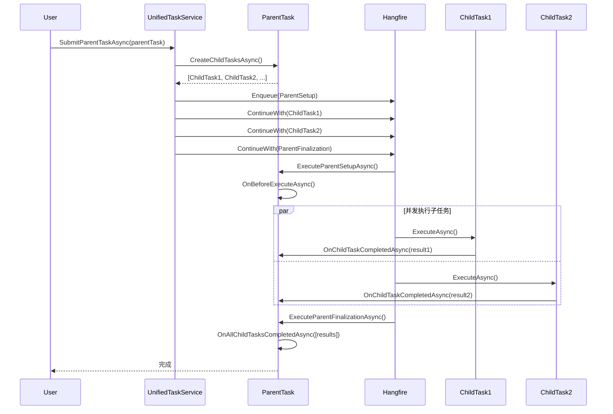

# 任务管理系统架构文档

## 目录
1. [系统概述](#系统概述)
2. [核心组件](#核心组件)
3. [接口体系](#接口体系)
4. [父子任务机制](#父子任务机制)
5. [进度报告系统](#进度报告系统)
6. [Hangfire集成](#hangfire集成)
7. [任务配置](#任务配置)
8. [数据模型](#数据模型)
9. [开发指南](#开发指南)
10. [最佳实践](#最佳实践)

## 系统概述

### 架构目标

NineKgTools的任务管理系统是一个**统一的后台任务调度引擎**，负责协调所有异步任务的执行、监控和管理。

**核心设计目标**：
- **统一接口**：所有任务实现统一的 ITask 接口
- **灵活调度**：支持即时任务、定时任务、父子任务
- **实时反馈**：提供进度报告和观察者模式通知
- **可扩展性**：易于添加新的任务类型

### 核心特性

- ✅ **5级优先级队列**：Critical、High、Normal、Low、Background
- ✅ **父子任务支持**：实现复杂的批量处理场景
- ✅ **实时进度追踪**：观察者模式，前端可订阅进度更新
- ✅ **Hangfire集成**：分布式任务调度和持久化
- ✅ **元数据存储**：任务对象和Hangfire Job解耦管理
- ✅ **配置驱动**：定时任务通过YAML配置文件管理

### 整体架构



### 技术选型

| 技术 | 用途 | 说明 |
|------|------|------|
| **Hangfire** | 任务调度框架 | 分布式、持久化、支持队列和重试 |
| **观察者模式** | 进度通知 | TaskProgressService 实现发布-订阅 |
| **IMemoryCache** | 元数据缓存 | 存储任务实例，24小时过期 |
| **IServiceScopeFactory** | 依赖注入 | 避免跨作用域的服务生命周期问题 |

## 核心组件

### 1. UnifiedTaskService（统一任务服务）

**位置**：`Core/Services/Tasks/UnifiedTaskService.cs`

**职责**：任务生命周期管理的**中央枢纽**，整合 Hangfire 和 ITask 接口。

**核心功能**：

```csharp
public class UnifiedTaskService
{
    // 提交即时任务
    public async Task<string> SubmitTaskAsync(ITask task, CancellationToken ct);

    // 执行任务（Hangfire入口）
    public async Task ExecuteTaskAsync(string taskId, PerformContext? context);

    // 提交父子任务
    public async Task<string> SubmitParentTaskAsync(IParentTask parentTask, CancellationToken ct);

    // 注册定时任务
    public void RegisterScheduledTask(string name, string type, string cron, ...);

    // 取消任务
    public async Task<bool> CancelTaskAsync(string taskId);

    // 获取任务状态
    public Models.Tasks.TaskStatus GetTaskStatus(string jobId);
}
```

**任务提交流程**：



### 2. TaskMetadataStore（元数据存储）

**位置**：`Core/Services/Tasks/TaskMetadataStore.cs`

**为什么需要元数据存储？**
- Hangfire 只存储 Job ID，不存储 ITask 实例
- 任务执行时需要恢复完整的任务对象和参数
- 支持任务查询和双向映射

**核心数据结构**：

```csharp
public class TaskMetadataStore
{
    private readonly IMemoryCache _cache;  // 任务实例缓存（24小时）
    private readonly ConcurrentDictionary<string, string> _jobToTaskMap;  // JobId → TaskId
    private readonly ConcurrentDictionary<string, string> _taskToJobMap;  // TaskId → JobId

    // 存储和获取任务
    public Task StoreTaskAsync(ITask task);
    public Task<ITask?> GetTaskAsync(string taskId);

    // ID映射管理
    public void MapJobToTask(string jobId, string taskId);
    public string? GetTaskIdByJobId(string jobId);
}
```

### 3. TaskProgressService（进度服务）

**位置**：`Core/Services/Progress/TaskProgressService.cs`

**职责**：实时跟踪任务进度，实现观察者模式通知。

**核心方法**：

```csharp
public class TaskProgressService
{
    // 创建进度追踪
    public TaskProgress CreateProgress(string taskId, string taskName);

    // 更新进度
    public void UpdateProgress(string taskId, Action<TaskProgress> updateAction);

    // 订阅进度（观察者模式）
    public void Subscribe(string taskId, ITaskProgressObserver observer);

    // 获取进度
    public TaskProgress? GetProgress(string taskId);
}
```

**观察者接口**：

```csharp
public interface ITaskProgressObserver
{
    string Name { get; }
    Task OnProgressUpdateAsync(TaskProgress progress);
}
```

### 4. ScheduledTaskFactory（任务工厂）

**位置**：`Core/Services/Tasks/ScheduledTaskFactory.cs`

**职责**：创建任务实例，整合依赖注入。

```csharp
public class ScheduledTaskFactory
{
    // 注册任务类型
    public void RegisterTask(string taskType, Type taskClass);

    // 创建任务实例（支持DI）
    public IScheduledTask? CreateTask(string taskType);
}
```

## 接口体系

### ITask（基础接口）

**位置**：`Core/Services/Tasks/Interfaces/ITask.cs`

所有任务的基础接口，定义核心属性和方法：

```csharp
public interface ITask
{
    // 基本属性
    string TaskId { get; }
    string TaskName { get; }
    string TaskType { get; }
    TaskPriority Priority { get; }

    // 父子关系
    string? ParentTaskId { get; set; }
    List<string> ChildTaskIds { get; }
    string? HangfireBatchId { get; set; }
    bool IsParentTask => ChildTaskIds.Count > 0;

    // 核心方法
    Task<TaskResult> ExecuteAsync(IProgressReporter progressReporter, CancellationToken ct);
    bool ValidateParameters();

    // 生命周期钩子
    Task OnBeforeExecuteAsync(CancellationToken ct);
    Task OnAfterExecuteAsync(TaskResult result, CancellationToken ct);
}
```

### IScheduledTask（定时任务）

**位置**：`Core/Services/Tasks/Interfaces/IScheduledTask.cs`

```csharp
public interface IScheduledTask : ITask
{
    string? CronExpression { get; }           // Cron表达式
    DateTime? LastExecutionTime { get; set; }
    DateTime? NextExecutionTime { get; set; }

    Task<TaskResult> ExecuteAsync(Dictionary<string, object>? parameters, CancellationToken ct);
}
```

**已实现的定时任务**：

| 任务类 | 功能 | 默认Cron |
|--------|------|----------|
| CacheCleanupTask | 清理过期缓存 | 每天凌晨2点 |
| MediaCleanupTask | 清理无效媒体记录 | 每天凌晨3点 |
| TagVectorSyncTask | 同步标签向量索引 | 每天凌晨3点 |
| MediaVectorSyncTask | 同步媒体向量索引 | 每天凌晨4点 |

### IIdentificationTask（识别任务）

**位置**：`Core/Services/Tasks/Interfaces/IIdentificationTask.cs`

```csharp
public interface IIdentificationTask : ITask
{
    string TargetPath { get; }
    bool IsBatch { get; }

    // 单文件识别
    Task<MediaBase?> IdentifyAsync(IProgressReporter pr, CancellationToken ct);

    // 批量识别
    Task<BatchIdentificationResult> IdentifyBatchAsync(IProgressReporter pr, CancellationToken ct);
}
```

**已实现的识别任务**：

| 任务类 | 功能 | 执行方式 |
|--------|------|----------|
| SingleSourceIdentificationTask | 单媒体源识别（文件或文件夹） | 同步执行 |
| BatchSourceIdentificationTask | 批量媒体源识别（支持深度控制） | 父子任务（每个文件一个子任务） |
| ManualIdentificationTask | 手动指定网站识别 | 同步执行 |

### IParentTask（父任务）

**位置**：`Core/Services/Tasks/Interfaces/IParentTask.cs`

```csharp
public interface IParentTask : ITask
{
    // 动态创建子任务列表
    Task<List<ITask>> CreateChildTasksAsync();

    // 单个子任务完成回调
    Task OnChildTaskCompletedAsync(string childTaskId, TaskResult result);

    // 所有子任务完成回调
    Task OnAllChildTasksCompletedAsync(List<TaskResult> childResults);
}
```

## 父子任务机制

### 执行流程

父子任务机制允许将一个大任务拆分为多个并发执行的子任务，充分利用 Hangfire 的并发能力。



### BatchSourceIdentificationTask 案例

**场景**：文件夹包含100个文件，需要并发识别。支持可控的扫描深度。

**实现思路**：
1. 父任务扫描文件夹，根据 maxDepth 参数控制扫描深度（0=当前目录，1=一级子目录，-1=无限递归）
2. 为每个有效的媒体源创建 SingleSourceIdentificationTask
3. 所有识别任务提交到 `identification` 队列
4. Hangfire 根据配置的 Worker 数量并发执行子任务
5. 每个子任务完成后，父任务实时收集结果
6. 所有子任务完成后，父任务汇总统计并启动文件夹监控

**并发控制**：通过配置文件中的 `max_concurrent_identification_tasks` 参数控制（默认5个）

**代码示例**：

```csharp
public class BatchSourceIdentificationTask : IParentTask, IIdentificationTask
{
    private readonly BatchIdentificationResult _batchResult = new();
    private readonly int _maxDepth; // -1=无限, 0=当前目录, 1=一级子目录

    // 1. 创建子任务
    public async Task<List<ITask>> CreateChildTasksAsync()
    {
        var files = await GetFilesToIdentifyAsync(); // 使用深度控制扫描
        var childTasks = new List<ITask>();

        foreach (var file in files)
        {
            var childTask = new SingleSourceIdentificationTask(
                _serviceScopeFactory, file, _options, Priority);
            childTask.ParentTaskId = this.TaskId;
            childTasks.Add(childTask);
        }

        return childTasks;
    }

    // 2. 子任务完成回调
    public Task OnChildTaskCompletedAsync(string childTaskId, TaskResult result)
    {
        if (result.Success)
        {
            _batchResult.IdentifiedMedias.Add(/* 从result提取数据 */);
        }
        else
        {
            _batchResult.FailedFiles.Add(/* 记录失败 */);
        }
        return Task.CompletedTask;
    }

    // 3. 所有子任务完成回调
    public Task OnAllChildTasksCompletedAsync(List<TaskResult> childResults)
    {
        _batchResult.TotalCount = childResults.Count;
        _batchResult.SuccessCount = childResults.Count(r => r.Success);
        // 汇总统计...
        return Task.CompletedTask;
    }
}
```

## 进度报告系统

### IProgressReporter 接口

任务在执行过程中通过 `IProgressReporter` 报告进度。

```csharp
public interface IProgressReporter
{
    void ReportStart(string taskName, int? totalItems = null);
    void ReportProgress(int processedItems, string? message = null);
    void ReportPhase(string phase, string? message = null);
    void ReportComplete(string? message = null);
    void ReportError(string errorMessage, Exception? exception = null);
}
```

### 使用示例

```csharp
public async Task<TaskResult> ExecuteAsync(IProgressReporter pr, CancellationToken ct)
{
    // 1. 报告开始
    pr.ReportStart("文件识别任务", totalItems: 1);

    try
    {
        // 2. 报告阶段
        pr.ReportPhase("解析文件名", "提取媒体信息");
        var info = ExtractMediaInfo(TargetPath);

        // 3. 报告进度
        pr.ReportProgress(0, "正在搜索网站");
        var media = await SearchWebsite(info);

        pr.ReportProgress(1, "识别完成");

        // 4. 报告完成
        pr.ReportComplete("成功识别媒体");

        return TaskResult.CreateSuccess(TaskId, TaskName, "识别成功");
    }
    catch (Exception ex)
    {
        // 5. 报告错误
        pr.ReportError("识别失败", ex);
        return TaskResult.CreateFailure(TaskId, TaskName, ex.Message, ex);
    }
}
```

### 观察者订阅

**前端订阅进度更新**：

```csharp
public class SignalRProgressObserver : ITaskProgressObserver
{
    public string Name => "SignalR通知";

    public async Task OnProgressUpdateAsync(TaskProgress progress)
    {
        // 推送到前端
        await _hubContext.Clients.All.SendAsync("TaskProgressUpdate", new
        {
            progress.TaskId,
            progress.ProgressPercentage,
            progress.CurrentMessage,
            progress.Status
        });
    }
}

// 订阅
_progressService.Subscribe(taskId, new SignalRProgressObserver());
```

## Hangfire集成

### 6级队列系统

任务根据类型和优先级分配到不同队列：

**队列列表**（按优先级从高到低）：
1. **critical** - 关键任务
2. **high** - 高优先级任务
3. **identification** - 识别任务专用队列（并发数由配置控制）
4. **default** - 普通任务
5. **low** - 低优先级任务
6. **background** - 后台任务

**队列路由规则**：

```csharp
private string GetQueueName(ITask task)
{
    // 识别任务使用专用队列
    if (task is IIdentificationTask)
    {
        return "identification";
    }

    // 其他任务根据优先级分配队列
    return priority switch
    {
        TaskPriority.Critical => "critical",
        TaskPriority.High => "high",
        TaskPriority.Normal => "default",
        TaskPriority.Low => "low",
        TaskPriority.Background => "background",
        _ => "default"
    };
}
```

**Hangfire Server 配置**：

```csharp
// 主服务器处理所有队列
builder.Services.AddHangfireServer(options =>
{
    options.Queues = new[] { "critical", "high", "identification", "default", "low", "background" };
    options.WorkerCount = Environment.ProcessorCount * 2;
});

// 识别队列专用服务器（提供精细并发控制）
builder.Services.AddHangfireServer(options =>
{
    options.Queues = new[] { "identification" };
    options.WorkerCount = config.Tasks.MaxConcurrentIdentificationTasks; // 默认5
    options.ServerName = "NineKgTools-Identification";
});
```

### 任务提交

```csharp
// 提交即时任务
var jobId = _backgroundJobClient.Enqueue<UnifiedTaskService>(
    service => service.ExecuteTaskAsync(task.TaskId, null));

// 提交定时任务
_recurringJobManager.AddOrUpdate(
    taskName,
    () => ExecuteScheduledTaskAsync(taskName, CancellationToken.None),
    cronExpression,
    new RecurringJobOptions { TimeZone = TimeZoneInfo.Local }
);
```

## 任务配置

### config.yaml 配置

**位置**：`Config/config.yaml`

```yaml
tasks:
  # 定时任务列表
  scheduled_tasks:
    - name: "缓存清理任务"
      type: "CacheCleanupTask"
      cron: "0 0 2 * * ?"        # 每天凌晨2点
      enabled: true
      priority: "Low"
      timeout_override: 10

    - name: "标签向量同步"
      type: "TagVectorSyncTask"
      cron: "0 0 3 * * ?"
      enabled: true
      priority: "Normal"

  # 全局配置
  retry_count: 3                        # 失败重试次数
  max_concurrent_identification_tasks: 5 # 最大并发识别任务数
```

## 数据模型

### TaskResult（任务结果）

```csharp
public class TaskResult
{
    public string TaskId { get; set; }
    public bool Success { get; set; }
    public TaskExecutionStatus Status { get; set; }
    public string? Message { get; set; }
    public DateTime StartTime { get; set; }
    public DateTime EndTime { get; set; }
    public int ProcessedItems { get; set; }
    public int FailedItems { get; set; }
    public Dictionary<string, object>? ResultData { get; set; }

    // 工厂方法
    public static TaskResult CreateSuccess(string taskId, string taskName, string message);
    public static TaskResult CreateFailure(string taskId, string taskName, string error, Exception? ex);
}
```

### TaskProgress（进度信息）

```csharp
public class TaskProgress
{
    public string TaskId { get; set; }
    public TaskExecutionStatus Status { get; set; }
    public double ProgressPercentage { get; set; }
    public string? CurrentPhase { get; set; }
    public int ProcessedItems { get; set; }

    // 父子关系
    public string? ParentTaskId { get; set; }
    public List<TaskProgress> ChildTasks { get; set; }

    // 聚合属性（递归计算）
    public double AggregatedProgressPercentage { get; }
    public TaskChildrenStats ChildrenStats { get; }
}
```

### TaskExecutionStatus（状态枚举）

```csharp
public enum TaskExecutionStatus
{
    Pending,      // 等待执行
    Running,      // 正在执行
    Succeeded,    // 执行成功
    Failed,       // 执行失败
    Cancelled,    // 已取消
    Skipped,      // 已跳过
    Timeout       // 超时
}
```

## 开发指南

### 创建新任务类型

**步骤**：

1. **实现 ITask 接口**：

```csharp
public class MyCustomTask : ITask
{
    private readonly IServiceScopeFactory _serviceScopeFactory;

    public string TaskId { get; init; } = Guid.NewGuid().ToString();
    public string TaskName => "我的自定义任务";
    public string TaskType => "CustomTask";
    public TaskPriority Priority => TaskPriority.Normal;

    public MyCustomTask(IServiceScopeFactory serviceScopeFactory)
    {
        _serviceScopeFactory = serviceScopeFactory;
    }

    public async Task<TaskResult> ExecuteAsync(IProgressReporter pr, CancellationToken ct)
    {
        pr.ReportStart(TaskName);

        using var scope = _serviceScopeFactory.CreateScope();
        var myService = scope.ServiceProvider.GetRequiredService<IMyService>();

        // 执行任务逻辑
        await myService.DoWorkAsync();

        pr.ReportComplete("任务完成");
        return TaskResult.CreateSuccess(TaskId, TaskName, "成功");
    }

    public bool ValidateParameters() => true;
    public Task OnBeforeExecuteAsync(CancellationToken ct) => Task.CompletedTask;
    public Task OnAfterExecuteAsync(TaskResult result, CancellationToken ct) => Task.CompletedTask;
}
```

2. **注册到 DI 容器**：

```csharp
// ServiceCollectionExtensions.cs
services.AddScoped<MyCustomTask>();
```

3. **提交任务**：

```csharp
var task = new MyCustomTask(serviceScopeFactory);
var jobId = await _unifiedTaskService.SubmitTaskAsync(task, cancellationToken);
```

### 创建父任务

```csharp
public class MyParentTask : IParentTask
{
    public async Task<List<ITask>> CreateChildTasksAsync()
    {
        var childTasks = new List<ITask>();
        for (int i = 0; i < 10; i++)
        {
            childTasks.Add(new MyChildTask(i) { ParentTaskId = this.TaskId });
        }
        return childTasks;
    }

    public Task OnAllChildTasksCompletedAsync(List<TaskResult> childResults)
    {
        var successCount = childResults.Count(r => r.Success);
        Log.Information("完成 {Success}/{Total} 个子任务", successCount, childResults.Count);
        return Task.CompletedTask;
    }
}
```

## 最佳实践

### 任务粒度设计

- ✅ **单一职责**：每个任务只做一件事
- ✅ **可重试**：任务应幂等，支持失败重试
- ✅ **超时控制**：避免长时间运行的任务
- ✅ **资源清理**：使用 using 确保资源释放

### 错误处理

```csharp
public async Task<TaskResult> ExecuteAsync(IProgressReporter pr, CancellationToken ct)
{
    try
    {
        // 业务逻辑
        await DoWorkAsync(ct);
        return TaskResult.CreateSuccess(TaskId, TaskName, "成功");
    }
    catch (OperationCanceledException)
    {
        // 取消操作
        return TaskResult.CreateFailure(TaskId, TaskName, "任务已取消");
    }
    catch (Exception ex)
    {
        // 记录错误日志
        Log.Error(ex, "任务 {TaskId} 执行失败", TaskId);
        pr.ReportError("执行失败", ex);
        return TaskResult.CreateFailure(TaskId, TaskName, ex.Message, ex);
    }
}
```

### 性能优化

- 使用 `IServiceScopeFactory` 避免服务生命周期问题
- 父子任务充分利用并发能力
- 合理设置 `max_concurrent_identification_tasks` 避免资源耗尽
- 定时任务错开执行时间，避免资源争抢

### 日志记录

```csharp
// 使用 Serilog 结构化日志
Log.Information("任务 {TaskId} 开始执行，类型：{TaskType}", TaskId, TaskType);
Log.Warning("任务 {TaskId} 重试第 {Retry} 次", TaskId, retryCount);
Log.Error(ex, "任务 {TaskId} 执行失败：{Message}", TaskId, ex.Message);
```
