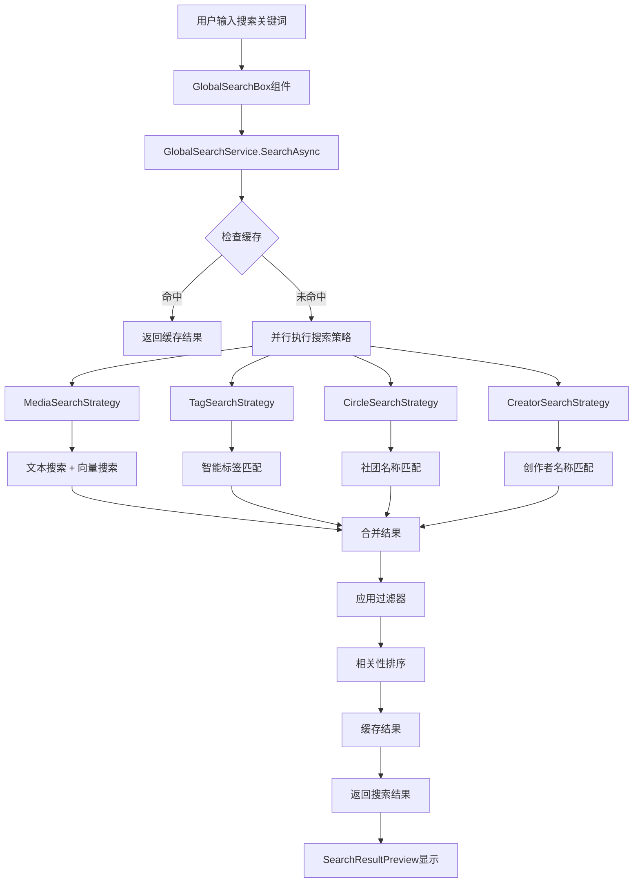

# NineKgTools 搜索系统技术文档

## 概述

NineKgTools 搭建了一套完整的智能搜索系统，支持多实体类型的统一搜索，结合文本搜索和向量语义搜索，提供高效、准确的搜索体验。

## 系统架构

### 核心组件架构
```
搜索系统架构
├── 前端组件层
│   ├── GlobalSearchBox.razor          # 全局搜索框组件
│   ├── SearchResultPreview.razor      # 搜索结果预览组件
│   └── SearchFilterDialog.razor       # 高级筛选对话框
├── 服务层
│   ├── GlobalSearchService            # 全局搜索服务
│   ├── SearchCacheManager            # 搜索缓存管理器
│   └── RelevanceScorer               # 相关性评分器
├── 搜索策略层
│   ├── MediaSearchStrategy           # 媒体搜索策略
│   ├── TagSearchStrategy            # 标签搜索策略
│   ├── CircleSearchStrategy         # 社团搜索策略
│   └── CreatorSearchStrategy        # 创作者搜索策略
├── 模型层
│   ├── GlobalSearchOptions          # 搜索选项模型
│   ├── GlobalSearchResult           # 搜索结果模型
│   └── SearchResultItem<T>          # 搜索结果项模型
└── 配置层
    ├── SearchConfig                 # 搜索主配置
    ├── TextSearchConfig            # 文本搜索配置
    └── VectorSearchConfig          # 向量搜索配置
```

## 搜索流程

### 1. 搜索执行流程


### 2. 搜索类型支持

#### 支持的实体类型
- **媒体 (Media)** - 音频、视频、游戏、图片、文本五大类型
- **标签 (Tag)** - 用户标签和系统标签
- **社团 (Circle)** - 创作团体和发行商
- **创作者 (Creator)** - 作者、画师、音乐家等

#### 搜索匹配类型
```csharp
public enum SearchMatchType
{
    Exact,        // 精确匹配 - 完全相同
    Fuzzy,        // 模糊匹配 - 相似度匹配
    Contains,     // 包含匹配 - 部分包含
    Vector,       // 向量语义匹配 - AI语义理解
    Alias,        // 别名匹配 - 别名和昵称
    Description   // 描述匹配 - 描述内容匹配
}
```

## 核心服务详解

### GlobalSearchService - 全局搜索服务

#### 主要功能
- **统一搜索入口** - 提供单一的搜索API接口
- **并行搜索执行** - 同时执行多种实体类型的搜索
- **缓存管理** - 智能缓存搜索结果提升性能
- **超时控制** - 防止搜索请求长时间阻塞

#### 核心方法
```csharp
public async Task<GlobalSearchResult> SearchAsync(GlobalSearchOptions options)
{
    // 1. 检查缓存
    var cachedResult = await _cacheManager.GetCachedResultAsync(options);
    if (cachedResult != null) return cachedResult;
    
    // 2. 执行搜索
    var result = await ExecuteSearchInternalAsync(options, cancellationToken);
    
    // 3. 缓存结果
    await _cacheManager.SetCachedResultAsync(options, result);
    
    return result;
}
```

#### 并发控制
- **信号量限制** - 使用 `SemaphoreSlim` 控制最大并发搜索数
- **任务并行** - 使用 `Task.WhenAll` 并行执行不同实体类型搜索
- **取消令牌** - 支持搜索取消和超时控制

### SearchCacheManager - 搜索缓存管理器

#### 缓存策略
- **内存缓存** - 使用 `IMemoryCache` 进行快速缓存
- **滑动过期** - 缓存项在指定时间内未访问则过期
- **智能键生成** - 基于搜索选项生成唯一缓存键

#### 缓存键构成
```csharp
private string GenerateCacheKey(GlobalSearchOptions options)
{
    // search:query:enableVector:entityTypes:filters:maxResults:minScore
    return $"search:{options.Query?.ToLowerInvariant()}:" +
           $"{options.EnableVectorSearch}:{(int)options.EntityTypes}:" +
           $"{FilterHash}:{options.MaxResultsPerType}:{options.MinRelevanceScore}";
}
```

### RelevanceScorer - 相关性评分器

#### 评分算法
1. **精确匹配** - 分数 1.0
2. **开头匹配** - 分数 0.8-0.9
3. **包含匹配** - 分数 0.5-0.7
4. **模糊匹配** - 基于编辑距离，分数 0-0.7
5. **字段权重** - 不同字段有不同权重

#### 字段权重系统
```csharp
private static double GetFieldWeight(string fieldName)
{
    return fieldName?.ToLowerInvariant() switch
    {
        "title" or "name" => 1.0,           // 标题/名称最高权重
        "aliastitle" or "aliasname" => 0.9, // 别名次高权重
        "summary" => 0.7,                   // 摘要中等权重
        "description" => 0.6,               // 描述较低权重
        _ => 0.5                            // 其他字段默认权重
    };
}
```

## 搜索策略详解

### MediaSearchStrategy - 媒体搜索策略

#### 搜索流程
1. **文本搜索** - 在标题、别名、摘要中搜索
2. **向量搜索** - 使用AI语义理解进行相似度搜索
3. **结果合并** - 合并文本和向量搜索结果
4. **过滤器应用** - 应用分类、标签、评分过滤器
5. **相关性排序** - 按相关性分数排序

#### 向量搜索集成
```csharp
if (options.EnableVectorSearch && _vectorService != null)
{
    // 生成查询向量
    var queryEmbedding = await _embeddingService.GenerateEmbeddingAsync(query);
    
    // 搜索相似媒体
    var vectorResults = await _vectorService.SearchMediaAsync(
        queryEmbedding, 
        topK: options.MaxResultsPerType * 2,
        threshold: _searchConfig.VectorSearch.MinVectorSimilarity
    );
    
    // 合并结果
    foreach (var vectorResult in vectorResults)
    {
        var existingResult = results.FirstOrDefault(r => r.Entity.Id == vectorResult.Entity.Id);
        if (existingResult != null)
        {
            // 组合分数
            existingResult.RelevanceScore = RelevanceScorer.CombineScores(
                existingResult.RelevanceScore,
                vectorResult.RelevanceScore,
                _searchConfig.VectorSearch.VectorSearchWeight
            );
        }
    }
}
```

### TagSearchStrategy - 标签搜索策略

#### 智能标签匹配
- **TagMatchingService集成** - 使用专门的标签匹配服务
- **多级匹配策略** - 用户映射 → 精确匹配 → 模糊匹配 → 向量匹配
- **置信度评估** - 每个匹配结果都有置信度分数

#### 匹配类型转换
```csharp
private SearchMatchType ConvertMatchType(TagMatchType tagMatchType)
{
    return tagMatchType switch
    {
        TagMatchType.UserMapping => SearchMatchType.Exact,
        TagMatchType.ExactMatch => SearchMatchType.Exact,
        TagMatchType.FuzzyMatch => SearchMatchType.Fuzzy,
        TagMatchType.VectorMatch => SearchMatchType.Vector,
        _ => SearchMatchType.Fuzzy
    };
}
```

### CircleSearchStrategy & CreatorSearchStrategy

#### 简化搜索逻辑
- **精确匹配** - 名称完全匹配
- **别名匹配** - 在别名列表中查找
- **模糊匹配** - 基于字符串相似度

## 配置系统

### SearchConfig - 主搜索配置

#### 核心配置项
```yaml
# 搜索功能开关
enable_global_search: true              # 是否启用全局搜索
enable_search_cache: true               # 是否启用搜索缓存
cache_expiration_minutes: 5             # 缓存过期时间（分钟）

# 性能控制
max_concurrent_searches: 10             # 最大并发搜索数
search_timeout_seconds: 30              # 搜索超时时间（秒）

# 结果控制
default_max_results_per_type: 20        # 每种类型默认最大结果数
default_min_relevance_score: 0.3        # 默认最小相关性分数
```

### TextSearchConfig - 文本搜索配置

#### 文本搜索选项
```yaml
# 高亮显示
enable_highlighting: true               # 是否启用搜索结果高亮
highlight_tag: "<mark>"                 # 高亮标签
```

### VectorSearchConfig - 向量搜索配置

#### 向量搜索选项
```yaml
# 功能开关
enable_for_media: true                  # 是否为媒体启用向量搜索
enable_for_tags: true                   # 是否为标签启用向量搜索

# 权重和阈值
vector_search_weight: 0.6               # 向量搜索权重
min_vector_similarity: 0.7              # 最小向量相似度
```

## 前端组件详解

### GlobalSearchBox - 全局搜索框

#### 组件特性
- **实时搜索** - 输入即搜索，无需点击搜索按钮
- **自动完成** - 基于 MudAutocomplete 的下拉搜索结果
- **状态指示** - 搜索状态的视觉反馈
- **快捷键支持** - Ctrl+K 快速聚焦搜索框

#### 核心状态管理
```csharp
// 搜索输入相关状态
protected string _searchQuery = string.Empty;
protected bool _isSearching = false;

// 搜索结果相关状态
protected GlobalSearchResult? _currentSearchResult;
protected GlobalSearchOptions _searchOptions = new()
{
    EntityTypes = SearchEntityTypes.All,
    EnableVectorSearch = false,
    MaxResultsPerType = 20,
    MinRelevanceScore = 0.3
};
```

#### 搜索建议实现
```csharp
protected async Task<IEnumerable<string?>> SearchSuggestions(string value)
{
    if (string.IsNullOrWhiteSpace(value) || value.Length < 2)
        return Enumerable.Empty<string?>();
    
    try
    {
        _isSearching = true;
        _searchOptions.Query = value;
        _currentSearchResult = await GlobalSearchService.SearchAsync(_searchOptions);
        
        if (_currentSearchResult?.TotalCount > 0)
        {
            return new[] { "search-results" }; // 触发ItemTemplate显示
        }
        
        return Enumerable.Empty<string?>();
    }
    finally
    {
        _isSearching = false;
    }
}
```

### SearchResultPreview - 搜索结果预览

#### 结果展示特性
- **分类展示** - 按实体类型分组显示结果
- **相关性指示** - 显示匹配类型和相关性分数
- **快速导航** - 点击结果直接跳转到详情页
- **性能指标** - 显示搜索耗时和是否使用AI搜索

#### 结果渲染逻辑
```csharp
// 媒体结果渲染
@foreach (var item in SearchResult.MediaResults.Take(MaxItemsPerSection))
{
    <MudCard Class="ultra-modern-result-card media-result-card" 
             OnClick="@(() => NavigateToMedia(item.Entity.Id))">
        <MudCardContent>
            <div class="d-flex align-center gap-3">
                <MudAvatar Size="Size.Large" Square="true">
                    <MudImage Src="@GetMediaPosterUrl(item.Entity)" />
                </MudAvatar>
                <div class="flex-grow-1">
                    <MudText Typo="Typo.subtitle1">@item.Entity.Title</MudText>
                    <div class="d-flex gap-2 mt-1">
                        <MudChip Size="Size.Small" Color="Color.Primary">
                            @GetMatchTypeText(item.MatchType)
                        </MudChip>
                        <MudChip Size="Size.Small" Color="Color.Success">
                            @item.RelevanceScore.ToString("P0")
                        </MudChip>
                    </div>
                </div>
            </div>
        </MudCardContent>
    </MudCard>
}
```

### SearchFilterDialog - 高级筛选对话框

#### 筛选功能
- **实体类型选择** - 选择要搜索的实体类型
- **向量搜索开关** - 启用/禁用AI语义搜索
- **分类筛选** - 按媒体分类筛选
- **标签筛选** - 按标签筛选
- **评分筛选** - 按评分范围筛选
- **搜索参数调整** - 调整结果数量和相关性阈值

## 性能优化

### 1. 缓存策略
- **内存缓存** - 热门搜索结果缓存在内存中
- **滑动过期** - 缓存项在5分钟内未访问则过期
- **智能失效** - 数据更新时自动清除相关缓存

### 2. 并发控制
- **信号量限制** - 最多10个并发搜索请求
- **任务并行** - 不同实体类型搜索并行执行
- **超时控制** - 30秒搜索超时防止阻塞

### 3. 索引优化
- **数据库索引** - 在搜索字段上建立索引
- **向量索引** - 使用SqliteVec进行向量索引
- **预加载策略** - 预热常用数据到内存

### 4. 前端优化
- **防抖处理** - 输入防抖减少搜索请求
- **虚拟滚动** - 大量结果时使用虚拟滚动
- **懒加载** - 图片和详细信息懒加载

## 扩展性设计

### 1. 策略模式
- **ISearchStrategy接口** - 统一的搜索策略接口
- **可插拔策略** - 新的实体类型可轻松添加搜索策略
- **策略组合** - 支持多种搜索策略的组合使用

### 2. 配置驱动
- **YAML配置** - 所有搜索参数都可通过配置文件调整
- **热更新** - 配置更改无需重启应用
- **环境隔离** - 不同环境可使用不同的搜索配置

### 3. 插件化架构
- **搜索插件** - 支持第三方搜索引擎集成
- **评分插件** - 自定义相关性评分算法
- **过滤插件** - 自定义搜索结果过滤器

这个搜索系统为NineKgTools提供了强大、灵活、高性能的搜索能力，结合了传统文本搜索和现代AI语义搜索的优势，为用户提供了优秀的搜索体验。
