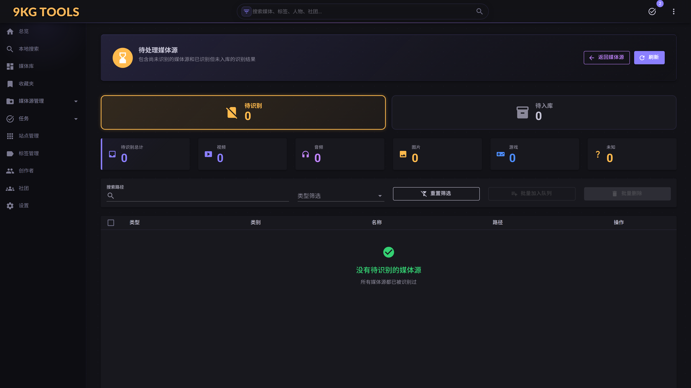

# 04. 待处理（`/source/pending`）

## 这个页面是干啥的？

待处理页面是**两类"还没完事"的媒体源的统一入口**：

1. **待识别**：扫到了文件，但识别还没跑过 / 跑过但失败
2. **待入库**：识别跑成功了、出了候选结果，但**还没人确认要入库**



> 这是项目里**最容易混淆**的概念——`MediaSource` 有两个布尔字段 `Identified` 和 `InDatabase`，组合出三种状态：
>
> | Identified | InDatabase | 显示在哪 |
> |---|---|---|
> | false | false | **待识别 Tab**（识别没成功） |
> | true | false | **待入库 Tab**（识别成功但等确认） |
> | true | true | 不在这里——已经在 `/media/overview` |

## 主要操作

### 我想看待识别队列在等啥

进页面默认就在"待识别 Tab"。每行是一个待识别的媒体源（文件夹或单文件），列：

| 列 | 内容 |
|---|---|
| ☐ | 多选 checkbox |
| 类型 | 顶级分类（音频/视频/...）chip，没识别成功时显示"未知" |
| 类别 | 文件夹 / 单文件 |
| 名称 | 路径名（点击复制完整路径） |
| 操作 | 多个图标按钮（响应式：移动端折叠为 `⋮` 菜单） |

行操作（默认全部展开）：

- **手动识别** ▶️：弹识别选项对话框 → 重跑识别
- **手动添加** ➕：跳过识别走 [手动添加流程](13-workflows.md#流程二批量手动添加)
- **加入识别队列** ➡️：批量识别（提交到 Hangfire）
- **打开文件位置** 📂：本地访问时打开资源管理器；远程访问自动隐藏
- **删除** 🗑️：删除 `MediaSource` 记录（不删硬盘文件）

### 我想看待入库队列里有啥已经识别好的

切到**待入库 Tab**——这里的每条**已经有识别结果**，只是没自动入库（因为 `auto_add_to_database = false` 或某种边界情况）。

每行额外显示"识别出的标题"——这就是即将入库的标题。

行操作：

- **预览** 👁️：弹 `MediaInfoDialog` 看完整识别结果，确认后入库
- **直接入库** ✅：跳过预览，直接入库（信任识别结果）
- **重新识别** 🔄：丢弃当前 Pending 结果，重跑一次识别
- **丢弃** 🚫：删除 Pending 结果（数据回到"待识别"状态）

### 我想批量识别 / 删除 / 入库

页面顶部有 ☐ 全选；选中后顶部出现批量工具栏：

**待识别 Tab**：
- 批量加入识别队列（最常用——一次性提交几十个）
- 批量删除

**待入库 Tab**：
- 批量入库
- 批量重新识别
- 批量丢弃

> 批量操作进行时，**整个页面进入锁定态**：刷新按钮、Tab 切换、筛选栏、分类卡片全部 disabled，避免你点错、避免重复提交。

### 我想筛选某种类型 / 搜索路径

筛选栏（在分类卡片下方）：

- **类型下拉**：全部 / 视频 / 音频 / 图片 / 文本 / 游戏 / 未知
- **路径关键字**：模糊搜索路径里包含某段字符的源
- **重置**按钮：清空所有筛选

筛选条件**两个 Tab 共享**——切换 Tab 时保留筛选。

### 我想从首页直达某个 Tab

主页"待处理"卡片支持深链：

```
/source/pending?tab=unidentified    # 直达待识别
/source/pending?tab=pending         # 直达待入库
```

不指定 `tab=` 默认进待识别。

## 进阶用法

<details>
<summary>分类统计卡片</summary>

筛选栏上方有 6 个统计卡片（视频/音频/图片/文本/游戏/未知），每卡显示当前 Tab 下该类型的条数。点卡片直接把类型筛选切到那个分类（替代手动从下拉选）。

正在加载时显示骨架屏；批量操作运行时整组卡片淡灰（`card-disabled`）告诉你不可点。

</details>

<details>
<summary>"重新识别"的语义细节</summary>

待入库 Tab 的"重新识别"会**用新结果替换旧 Pending**——旧结果被丢弃，新结果存到 Pending 表。

而**已入库**媒体的"重新识别"在 `/source/{id}` 详情页发起，那个的语义是：**先删旧 Media + 关联图片/向量，再用新结果重新建 Media**。MediaSource 自身保留并复用，所以不会破坏 watch_folders 自动监控。

这两种"重新识别"的实现都走 `FilesService.AddMediaToDatabase` 入库路径，确保 `Identified` / `InDatabase` 两个布尔位维护一致。

</details>

<details>
<summary>识别诊断从哪看</summary>

每条识别失败的源，**没有按钮直接跳诊断**——但可以通过任务历史看：

`/tasks/history` → 找该源对应的识别任务 → "详情"对话框 → "识别诊断"Tab。

详细见 [08 任务系统 - 识别诊断](08-tasks.md#识别诊断快照)。

</details>

## 跟其他页面的关系

```
（自动入口）
   ↓
/source/pending
   ├─ 行内"手动识别" → 跳出对话框 → 入 /tasks 队列 → 完成后回到此页
   ├─ 行内"手动添加" → ManualAddMediaDialog → /media/{newId}?edit=true
   ├─ 行内"打开文件位置" → 操作系统的 文件管理器
   ├─ Tab 切换 → 同页换 Tab（深链 ?tab=...）
   └─ "返回媒体源" → /sources（详见 05）
```

## 常见问题

### Q：明明扫了 100 个文件夹，待识别 Tab 只显示 20 条

筛选栏的"类型"下拉默认可能是"未知"——因为还没识别所以确实是未知；但你可能希望看全部。点"重置筛选"。

### Q：待入库 Tab 永远是空的

如果 `Settings → 识别 Tab → auto_add_to_database = true`（默认）：识别成功就直接入库，**永远不会进 Pending**。要看待入库流：

1. 把 `auto_add_to_database` 改为 false 保存
2. 重新识别一些源
3. 这时候识别成功的会进待入库 Tab 等你确认

### Q：删除待识别的某条会把硬盘文件也删掉吗

**不会**。这里的"删除"只删 `MediaSource` 数据库记录。硬盘文件原封不动。要删硬盘文件请用文件管理器（"打开文件位置"按钮帮你打开）。

### Q：批量"加入识别队列"按钮为什么有时灰着

正在执行另一个批量任务——页面会全锁定。等任务跑完。

### Q：待入库的某条预览后发现识别错了

点预览对话框的"取消" → 不入库。然后点行操作的"重新识别"换条结果。或者干脆"丢弃"重新走一次完整识别流程。
