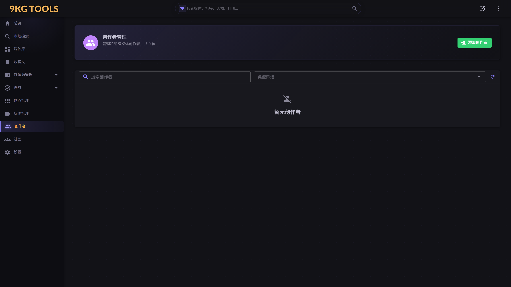

# 09. 创作者 & 社团（`/creators` & `/circles`）

## 这个页面是干啥的？

**创作者（Creator）**和**社团（Circle）**是媒体的"出品方"维度：

- **创作者** = 个人（声优、画师、编剧、音乐人...）
- **社团** = 团体（同人社、独立游戏工作室、出版社...）



两个页面**结构完全相同**——除了 Creator 是个人 / Circle 是团体外，UI 和操作 1:1 对称。本章节合在一起讲。

> 关系：一部作品**有 0-N 个创作者** + **0-1 个社团**。识别时会从识别源（DLsite/Bangumi/Steam）抓取并自动建立关联。

## 主要操作

### 我想浏览所有创作者 / 社团

进 `/creators`（或 `/circles`）：

- 顶部统计卡：总数 / 关联媒体最多的几个
- 主体：创作者卡片网格，每张显示头像（如有）+ 名字 + 关联媒体数
- 筛选 / 排序 / 搜索 / 分页（沿用 `MediaShownView` 风格的分页栏）

### 我想看某个创作者的所有作品

点卡片 → 跳转 `/creators?id=123`（创作者详情页或弹出对话框，取决于 v1.0 的 UI 设计）：

- 顶部：创作者基本信息（名字、别名、简介、头像）
- 底部：关联媒体列表（按收录顺序 / 评分 / 时间排序）

### 我想新建一个创作者 / 社团

页面右上"添加创作者"按钮 → 弹对话框：

| 字段 | 必填 | 说明 |
|---|---|---|
| 名字 | ✅ | DB 唯一键 |
| 别名 | ❌ | 多个名字（如笔名 / 罗马字 / 中文名） |
| 简介 | ❌ | 一段描述 |
| 头像 URL | ❌ | 公开图片 URL（如 bgm.tv 头像链接） |

保存。新创作者出现在列表，初始没关联媒体——通过媒体详情页编辑添加关联。

### 我想给已有媒体补充创作者关联

进 `/media/{id}` 详情页 → 编辑模式 → 创作者字段（多选下拉）→ 加 / 减 → 保存。

如果下拉里**找不到要加的创作者** → 先去 `/creators` 新建一个 → 回到媒体详情页再加。

### 我想合并两个重复的创作者

经常出现：识别源用日文名建了一个 "佐倉綾音"，另一个识别用罗马字建了 "Sakura Ayane"。需要合并。

v1.0 **没有 UI 合并按钮** —— 手动两步：

1. 进重复的创作者详情 → 选所有关联媒体 → 多选 → "改创作者关联" → 选目标创作者
2. 删旧创作者

v1.1 计划"创作者合并"按钮一键完成。

### 我想删除创作者

页面 ⋮ 菜单 → 删除 → 弹 `NineKgConfirmDialog Destructive`：
- 显示该创作者关联的媒体数
- 警告"此操作不可撤销"
- 确认

> 删创作者**不删媒体**——只解除关系。媒体的创作者列表里那一项会消失。

## 进阶用法

<details>
<summary>识别源带回的创作者字段映射</summary>

不同识别源的"创作者"概念不同：

| 识别源 | 来源字段 | 在项目里的归属 |
|---|---|---|
| DLsite 游戏 | `Circle`（社团/品牌） | Circle |
| DLsite 游戏 | `ScreenWriter`（编剧）/ `Illustrator`（插画师）/ `VoiceActor`（声优）/ `Musician`（音乐） | Creator（多个） |
| DLsite 视频 | `Circle` | Circle |
| DLsite 视频 | `Actor`（声优）等 | Creator |
| Bangumi | `infobox` 里的 staff 项 | Creator |
| Steam | `developers[0]` | Circle |

详见 [`CLAUDE.md` - 识别网站](../../CLAUDE.md#识别网站iwebsite-实现) 和具体的 `DLsiteService.Game.cs` / `DLsiteService.Video.cs`。

</details>

<details>
<summary>头像图片</summary>

v1.0 没有上传头像 UI——只能贴外链 URL（图片得是公网可访问，否则浏览器加载不出）。

v1.1 计划本地上传 + 缩略图自动生成。

</details>

<details>
<summary>创作者搜索</summary>

`/search` 全局搜索默认包含创作者类型——输入名字会出现在"创作者 (N)"chip 下。

如果想专门搜某个创作者关联的所有媒体：进 `/creators` 找到他 → 点进详情看媒体列表，比 `/search` 更直接。

</details>

## 跟其他页面的关系

```
/creators                       ← 创作者列表
   ├─ 点卡 → 创作者详情（媒体列表）
   │     └─ 点媒体 → /media/{id}
   ├─ "添加创作者"按钮
   └─ 删除流程 → NineKgConfirmDialog

/circles                        ← 社团列表（结构同 /creators）

/media/{id} 详情页 → 创作者 / 社团字段 → 编辑模式可改关联

/search → 创作者 chip → 跳到对应创作者
```

## 常见问题

### Q：识别后看到一堆名字看不懂的创作者

DLsite/Bangumi 返回的是**原文名**——日文 / 罗马字。如果你想用中文名，进创作者详情：

1. 改"名字"为中文译名
2. 把日文原名加到"别名"里

这样识别时仍能匹配（别名也参与匹配），但展示是中文。

### Q：能批量管理 / 改创作者吗

v1.0 多选 + 批量操作支持有限：批量删除 ✅，批量改属性 ❌。复杂操作只能逐个。

### Q：Creator 和 Circle 怎么选？

判断标准：

- **个人** → Creator（即使他用艺名）
- **2 人或以上的合作团体** → Circle
- **公司 / 品牌** → Circle

如果识别源里某条信息是公司发布的但实际是某个人主导，按 Circle 录入更尊重识别源结构；自定义可补 Creator + 把这个人加进 Circle 关联（v1.1 计划"Circle members" 关系）。

### Q：能给创作者加 social link 吗（Twitter / Pixiv）

v1.0 只支持简介 + 头像 URL，没专门的社交链接字段。临时方案：把链接写在简介里。

v1.1 计划专门的 `social_links` 字段（结构化）。

### Q：删了某个媒体，创作者关联自动清掉吗

是的——`Media` 实体级联删除时会自动解除 `MediaCreators` / `MediaCircles` 中间表的关联。但创作者本体不会被删（因为可能还关联其他媒体）。
