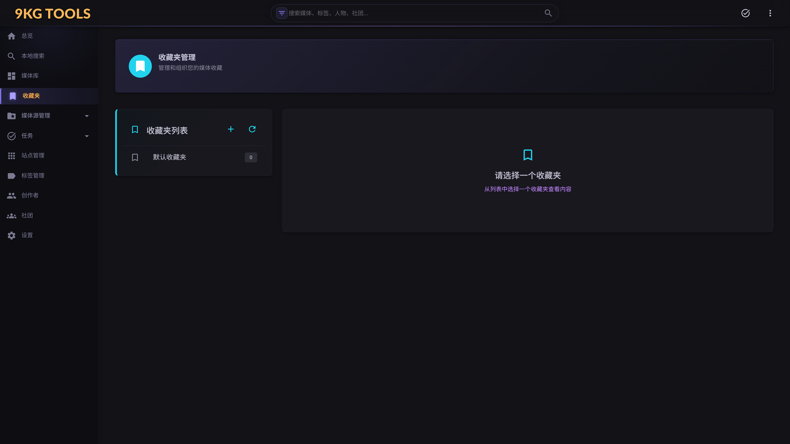

# 10. 收藏夹（`/favorites`）

## 这个页面是干啥的？

收藏夹是**对媒体的二次组织**——独立于"分类"和"标签"的另一种自定义分组方式。



典型用途：

- **本月新欢**：当下经常听 / 玩的一组
- **想试还没试**：标记 backlog
- **送朋友**：自己整理的 mixtape
- **按心情**：放松向 / 高强度向 / 治愈向

> 跟"标签"的区别：**标签是描述性的**（这部作品**是**啥），**收藏夹是态度性的**（你**对它的关系**）。一部作品可以被多个收藏夹包含。

## 主要操作

### 我想新建一个收藏夹

`/favorites` 页面左侧"收藏夹列表"上方的 **+** 按钮：

- 输入名称（必填）
- 描述（可选）
- 颜色（可选，UI 区分）
- 保存

新建后立即出现在左侧列表，初始空。

### 我想看某个收藏夹里有啥

左侧列表点击该收藏夹 → 右侧加载该收藏夹的所有媒体，沿用 `MediaShownView` 组件（跟 `/media/overview` 一致）：

- 网格 / 列表视图切换
- 筛选（标签、评分、日期）
- 排序（创建时间、评分、标题）
- 分页

### 我想把媒体加进 / 移出收藏夹

**单条操作**：

进 `/media/{id}` → 右上角 **⭐ 收藏** 按钮（多选下拉）→ 勾选想加入的收藏夹 → 保存。

**批量操作**：

进 `/media/overview` 多选媒体 → 顶部 **批量加收藏夹** → 选目标收藏夹。

或者反向操作：进收藏夹页面 → 多选媒体 → **批量移出**。

### 我想删除一个收藏夹

收藏夹卡片右上角 ⋮ 菜单 → "删除"。

弹 `NineKgConfirmDialog Destructive`：
- 显示目标名 + 包含的媒体数
- "此操作不可撤销"警告行
- 强制确认

> 删收藏夹**不会**删里面的媒体——只是解除收藏关系。

### 我想给收藏夹改名 / 换颜色

收藏夹卡片右上角 ⋮ 菜单 → "编辑" → 弹对话框改属性。

## 进阶用法

<details>
<summary>"默认收藏夹"</summary>

首次启动时自动创建一个"默认收藏夹"。

它**不能删**（删除按钮 disabled）——确保至少有一个收藏夹存在。

可以改名 / 改颜色。

</details>

<details>
<summary>用收藏夹做"个人评分体系"</summary>

NineKgTools 的标签是从识别源拉的+映射的，不太适合做"主观偏好"。

很多用户用收藏夹做评分维度：

- "🔥 必听"
- "💤 一般"
- "❌ 雷"

或者按主题：

- "🎧 通勤听"
- "🛌 睡前听"

后续筛选 / 搜索都能基于收藏夹来——比标签更纯粹。

</details>

<details>
<summary>导出收藏夹</summary>

v1.0 没有 UI 导出。但可以从 SQLite 直接查：

```sql
-- Database/database.db
SELECT m.Title, m.Rating, m.CreatedAt
FROM Medias m
JOIN MediaFavorites mf ON m.Id = mf.MediaId
WHERE mf.FavoriteId = <收藏夹 id>
ORDER BY mf.CreatedAt DESC;
```

v1.1 计划"导出 CSV / 分享链接"功能。

</details>

## 跟其他页面的关系

```
/favorites                ← 你在这
   ├─ 点收藏夹卡 → 该收藏夹的媒体列表（沿用 MediaShownView）
   │      ├─ 点媒体 → /media/{id}（详情）
   │      └─ 多选 + 批量移出 → 解除关系
   └─ 删除按钮 → NineKgConfirmDialog Destructive

/media/{id} 详情页 → ⭐ 收藏 按钮 → 多选下拉勾 → 保存
/media/overview 列表 → 多选 → 批量加收藏夹
```

## 常见问题

### Q：删了收藏夹里的媒体不见了

那不是"删除媒体"——只是从这个收藏夹移出。媒体本体还在 `/media/overview`。

要彻底删除媒体本体：进 `/media/{id}` → 右上 删除按钮 → 走 `NineKgConfirmDialog Destructive` 流程。

### Q：能给收藏夹设排序吗（自定义顺序）

v1.0 收藏夹按创建时间倒序展示，不支持手动排序。媒体在某个收藏夹内可以选排序方式（创建时间 / 评分 / 标题）。

### Q：收藏夹支持嵌套（文件夹/子收藏夹）吗

不支持，只有单层。如果你需要分层组织，建议用**收藏夹名前缀**模拟：

- `本月-必听`
- `本月-推荐`
- `历史-2025年度`

或用标签 + 收藏夹组合。

### Q：每个媒体能在几个收藏夹

不限。一条媒体可以同时在 5 个收藏夹里。
