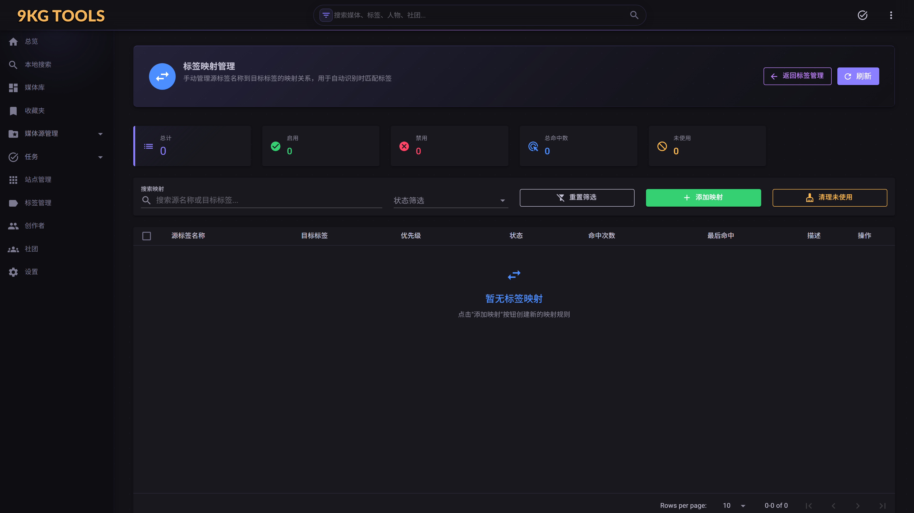

# 13. 端到端工作流

> 把分散的页面操作串起来，按"真实使用场景"给完整路径。**强烈建议先读这章**，再回头看各分页的细节文档。

四个最常见的工作流：

| # | 工作流 | 适合场景 |
|---|---|---|
| 一 | [监视文件夹全自动](#流程一监视文件夹全自动) | 我有个 NAS 目录，新东西扔进去就帮我识别入库 |
| 二 | [批量手动添加](#流程二批量手动添加) | 我有几百条冷门资源识别源都搜不到，要一口气加进去 |
| 三 | [重新识别 + 替换](#流程三重新识别--替换) | 之前识别的结果不对，想换识别源或重跑 |
| 四 | [标签清理 + 映射](#流程四标签清理--映射) | 识别源带回来的标签太乱，想统一规范 |

---

## 流程一：监视文件夹全自动

**目标**：在 NAS 上有个 `Z:\Media\Audio` 目录，往里拖音声作品后**应用自动识别 + 入库**，不用我点任何按钮。

### 步骤

#### 1. 配 watch_folders

`/settings → 媒体源 Tab`：

```
监视文件夹:
  - Z:\Media\Audio
  - Z:\Media\Game
```

> Docker 部署写容器内路径（如 `/app/media`），主机目录用 volume 挂载。

保存 → 应用启动会立即扫一遍这两个目录的现有内容。

#### 2. 验证识别源已就绪

`/website` 看三大识别源（DLsite / Bangumi / Steam）启用状态：


DLsite 是音声主力，**确保启用**。Bangumi 适合视频/游戏。

#### 3. 检查识别策略

`/settings → 识别 Tab`：

| 字段 | 推荐值 | 说明 |
|---|---|---|
| `auto_add_to_database` | **true** | 自动入库（不需要人工确认） |
| `min_similarity` | 0.6-0.8 | 低于此分数不入库 |
| `pending_retention_days` | 30 | 暂存"待入库"30 天后清 |

如果你想"识别成功也先放 Pending、人工 review 后入库"，把 `auto_add_to_database` 设 false——这就切到了[流程二](#流程二批量手动添加)的混合模式。

#### 4. 拖文件进去

往 `Z:\Media\Audio` 里拖一个文件夹（如 `RJ01081508`）。

后台会发生：

```
FileSystemWatcher 触发
  ↓
SingleSourceIdentificationTask 入 identification 队列
  ↓
WebsiteService 按优先级试 DLsite → Bangumi → Steam
  ↓
首个返回相似度 ≥ min_similarity 的命中 → 选中
  ↓
若 auto_add_to_database=true → 直接入库
若 false                       → 进 Pending 等人工
```

#### 5. 看实时进度

`/tasks` 上方"运行中的任务"区域会出现一条识别任务，进度条 + 实时刷新。详见 [08 任务](08-tasks.md)。

#### 6. 验证

进 `/media/overview` 看新条目；点封面进 `/media/{id}` 看完整详情。

### 失败处理

进 `/source/pending` 看"待识别 Tab"——所有识别失败的源都在这。点"识别诊断"按钮看到底卡在哪一站、为什么没命中。

---

## 流程二：批量手动添加

**目标**：我在网上 / 群里收集了 30 个**冷门到识别源都搜不到**的资源（个人录制 / 老旧作品 / 私人发布），想一次性都加进媒体库。

### 步骤

#### 1. 把文件放到一个临时目录

```
D:\Inbox\批量待添加\
  ├── 老作品 001\
  ├── 老作品 002\
  └── ...30 个文件夹
```

#### 2. 进 `/sources` 浏览

左侧文件浏览器导航到 `D:\Inbox\批量待添加`。所有 30 个文件夹会列出。

每行右侧有两个按钮：
- **尝试识别**：让识别源跑一遍（多半会失败）
- **手动添加**：直接进入手动添加流程

#### 3. 选第一个文件夹 → 手动添加

弹 `ManualAddMediaDialog`：

| 字段 | 必填 | 说明 |
|---|---|---|
| 标题 | ✅ | 你想叫它啥 |
| 顶级分类 | ✅ | 视频 / 音频 / 游戏 / 图片 / 文本（chip 选） |
| 具体分类 | ❌ | 比如"音频"下细分"音声/有声书/音乐" |
| 简介 | ❌ | 一段描述 |
| 评分 | ❌ | MudRating |

**只填标题 + 分类**两个必填 → 点"添加" → 自动跳到 `/media/{id}?edit=true` 让你继续填详情。

**展开"填更多信息"手风琴填了任一选填** → 点"添加" → 直接跳到 `/media/{id}` 详情页（不进入编辑态）。

#### 4. 重复 30 次

…太累。所以更聪明的做法是**结合 [流程四](#流程四标签清理--映射)** 的批量添加：写一个脚本生成 30 行 yaml，然后用 `manual-import.ps1`（v1.1 计划）一键导入。v1.0 阶段只能逐个手动。

### 替代：让 watch_folders 帮你

如果**临时把 `D:\Inbox\批量待添加\` 加进 watch_folders**，30 个文件夹会被自动尝试识别。失败的进 `/source/pending` 待识别 Tab，那里有"批量手动添加"的多选操作（v1.1 计划）。

---

## 流程三：重新识别 + 替换

**目标**：之前的识别把 DLsite 的某条音声错当成另一条。想重跑，让 Bangumi 优先。

### 步骤

#### 1. 找到目标媒体

`/media/overview` → 搜索或翻到那条 → 点封面进 `/media/{id}`。

#### 2. 进对应媒体源详情

详情页找"媒体源"链接 → 跳到 `/source/{sourceId}`。

#### 3. 改类别 / 触发重新识别

`/source/{id}` 页面：
- **媒体源类型**下拉 → 改"音频" → "视频"（如果之前认错了类别）
- **重新识别**按钮 → 弹出识别选项对话框：
  - 临时调整网站优先级（不影响全局配置）
  - 临时调整 `min_similarity`
  - 是否跳过缓存

#### 4. 看进度 + 确认

跑出来后弹 `MediaInfoDialog` 让你预览新结果——

- 满意 → "添加到数据库"。**重要**：这会**先删旧 Media 再插新 Media**（旧的图片/向量也清掉，但 MediaSource 自身保留并复用）。
- 不满意 → "取消"，旧的不变。

#### 5. 验证向量已更新

`/tasks/scheduled` → 找 `MediaVectorSync` → "立即触发"。让搜索也跟上新结果。

> 也可以等定时任务每 6 小时自动跑。

### 进阶：批量重新识别

`/source/pending` 待入库 Tab → 多选 → "重新识别"。但这只对 `auto_add_to_database=false` 时进 Pending 的记录生效。已入库的媒体只能逐条来。

---

## 流程四：标签清理 + 映射

**目标**：DLsite 抓回来"巨乳"、"爆乳"、"巨乳/爆乳"三个标签都被建出来了。我想全部归到"巨乳/爆乳"一个。

### 步骤

#### 1. 确认混乱情况

`/tags` → 看"巨乳"、"爆乳"两条独立的标签 → 各自媒体数。

#### 2. 决定主标签

让"巨乳/爆乳"作为权威标签（已存在），把另外两个作为映射源。

#### 3. 进 `/tags/mappings`



点"添加映射"：

| 字段 | 值 |
|---|---|
| 源标签名 | 巨乳 |
| 目标标签 | 巨乳/爆乳（从下拉选） |
| 优先级 | 10 |
| 启用 | ✅ |

再加一条：源 = "爆乳" → 目标 = "巨乳/爆乳"。

#### 4. 重新识别让映射生效

映射只在**识别时**起作用——下次识别源返回"巨乳" → 直接命中"巨乳/爆乳"，不会再创建独立标签。

但**已存在的"巨乳"和"爆乳"标签下挂的媒体**怎么办？v1.0 没有"应用映射到现有数据"的批量按钮，需要手动：

#### 5. 把旧标签合并到主标签

进 `/tag/{巨乳的id}`：
- 看媒体清单
- 选中所有媒体 → "添加到标签" → 选"巨乳/爆乳"
- 验证媒体在两个标签下都有
- 回 `/tags` → 删掉"巨乳"

对"爆乳"重复一遍。

> v1.1 计划"标签合并"按钮，能一键完成"重定向所有媒体 + 删源标签"。

#### 6. 同步向量库

`/tasks/scheduled` → `TagVectorSync` → "立即触发"。让向量搜索也认识新映射。

---

## 总结：哪个流程对应哪个页面

```
流程一 监视目录全自动:
  /settings → /sources → (自动) → /tasks → /media/overview

流程二 批量手动添加:
  /sources → ManualAddMediaDialog → /media/{id}?edit=true

流程三 重新识别替换:
  /media/{id} → /source/{id} → 重新识别 → /tasks → 确认对话框

流程四 标签清理映射:
  /tags → /tags/mappings → /tag/{id}（合并）→ /tasks/scheduled (向量同步)
```

碰到具体页面的细节卡住，回头查对应单页文档：
- [03 媒体库](03-media-library.md) / [04 待处理](04-pending.md) / [05 媒体源](05-sources.md)
- [06 标签](06-tags.md) / [08 任务](08-tasks.md) / [11 识别源](11-website.md)
